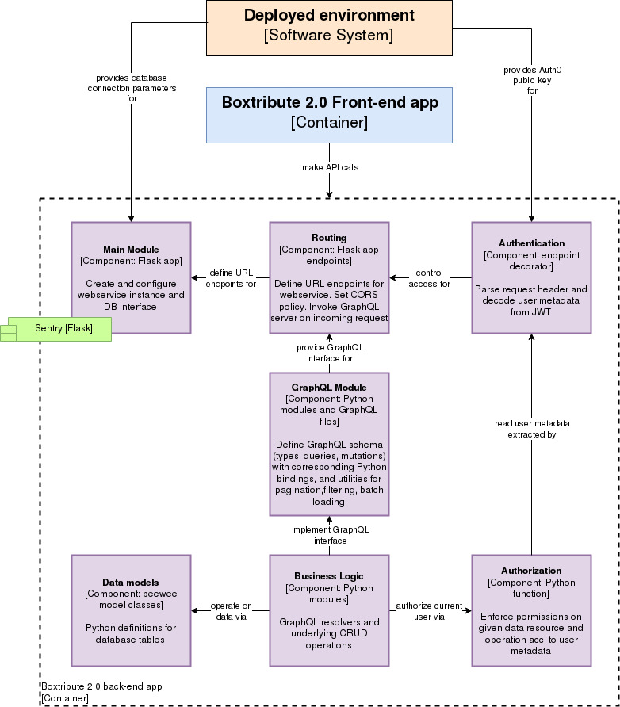

## Readme

## Table of Contents

1. [Contribution Guidelines](../CONTRIBUTING.md)
1. [Minimal development set-up](#minimal-development-set-up)
   1. [Install python](#install-python)
   2. [Set-up pre-commit](#set-up-pre-commit)
1. [Back-end development set-up](#back-end-development-set-up)
   1. [Test environment set-up](#test-environment-set-up)
   1. [Linting and Formatting in VSCode](#linting-and-formatting-in-vscode)
   1. [Working with MySQL](#working-with-mysql)
   1. [Debugging](#debugging)
1. [Testing](#testing)
1. [Architecture](#architecture)
1. [GraphQL API](#graphql-api)
1. [Project structure](#project-structure)
1. [Production environment](#production-environment)
1. [Performance evaluation](#performance-evaluation)
1. [Authentication and Authorization on the back-end](#authentication-and-authorization)

## Minimal development set-up

The following steps build on top of each other and have to be performed in correct order. Installing Python incl. a virtual environment and pre-commit is mandatory for all developers.

### Install python

Install [Python >=3.12](https://www.python.org/downloads/) on your computer. You will need it to run tests on the back-end and the formatters and linters on both back-end and front-end.

### Create a Python virtual environment

A [Python virtual environments](https://docs.python.org/3/library/venv.html) helps to isolate the project's Python environment (i.e. installed packages) from the global one. Internally this works by injecting a project-specific path into Python's import path look-up. Execute the following command in the repo root to create a `.venv` folder that will hold project-specific dependencies

    python3 -m venv .venv

You should notice a `(.venv)` element in your shell prompt which means that the virtual environment is activated. **Please note** that you have to manually activate the virtual environment every time you launch a new shell by

    source .venv/bin/activate

On Windows run instead

    .\.venv\Scripts\activate

<details>
  <summary>You can automate the activation of the virtual environment. Click to read more.</summary>

Virtual environments (venvs for short) must be activated and deactivated. If you are moving through folders in the terminal it can easily happen that you either miss activating or deactivating the venv resulting in errors and time wasted for development. With the [direnv](https://github.com/direnv/direnv) tool you can automate the activation and deactivation of venv depending on which folder you are in. There is already a `example.envrc` file in the root of this repo. If you install `direnv`, copy the `example.envrc` file into `.envrc` and allow to run it for your local repo, it will activate the Python virtual environment `venv` every time you enter the folder via a command line.

</details>

### Set-up pre-commit

[Pre-commit](https://pre-commit.com/) enables us to run code quality checks, such as missing semicolons, trailing whitespace, and debug statements, as well as consistent code formatting, before you commit your code. We chose pre-commit since it enables us to run these checks for both front-end and back-end in just one place.

1.  Install pre-commit and the linters/formatters (all declared in `/back/requirements-dev.txt`). Run the command from the root folder of the repo

        pip install -U -e back -r back/requirements-dev.txt

2.  Install the git hooks

        pre-commit install --overwrite

3.  Run the `pre-commit` checks to verify the setup (it might actually show some complaints)

        git ls-files -- back | xargs pre-commit run --files

Now you're all set up using Python code quality tools! `pre-commit` automatically checks the staged patch before committing. If it rejects a patch, add the corrections and try to commit again.

To figure out what else you can do with pre-commit, check out this [link](https://pre-commit.com/#usage).

## Back-end development set-up

The following are a couple of recommendations for IDE integration, database interaction, debugging, working with Docker, etc.

### Test environment set-up

**Crucial for running tests!**

Install the dependencies of the app in the activated virtual environment

    pip install -U -e back -r back/requirements-dev.txt

Create `.env` file with environment variables

    cp example.env .env

For the integration tests authentication information is fetched from the [Auth0](https://auth0.com) website. Log in and select `Applications` -> `Applications` from the side bar menu. Select `boxtribute-dev-api`. Copy the `Client Secret` into the `.env` file as the `TEST_AUTH0_CLIENT_SECRET` variable.

### Linting and Formatting in VSCode

Most of our developers are using VSCode. Instead of running our linter (flake8) and our formatter (black) for Python just when you are committing your code, we added a few settings in `.vscode/settings.json` so that your files are formatted and linted when you save a Python file.

### Working with MySQL

Since we are working with Docker you do not have to install a local MySQL server on your computer. Instead, you can just connect to the MySQL server in one of the Docker containers.

The development database is called `dropapp_dev` and the password is `dropapp_root` for the user `root`.

#### General notes on Docker network

In `docker-compose.yml` we define a separate Docker network called `backend` to which the back-end containers are joined. Each container can now look up the host name `webapp` or `db` and get back the appropriate container’s IP address.
To access the MySQL database, there are now four possibilities:

1. Inside the `webapp` container, you reach the MySQL DB at the host `db` using port 3306
1. You execute the MySQL command line client in the running container by `docker compose exec db mysql -u root -pdropapp_root -D dropapp_dev`
1. You connect to the MySQL host `localhost` using port 32000.
1. You specify the IP-address of the gateway for the host using port 32000

To figure out the gateway of the Docker network `backend` run

    docker network inspect -f '{{range .IPAM.Config}}{{.Gateway}}{{end}}' boxtribute_backend

#### MySQL workbench or other editors

Most of our developers use [MySQL workbench](https://dev.mysql.com/doc/workbench/en/wb-installing.html) to interact with the database directly. If you want to connect to the database, use `127.0.0.1` as host and 32000 as port.

#### Database seed

The `db` docker-compose service runs on a dump (`back/init.sql`) generated from a minimal DB seed enriched with fake data. To create the dump, e.g. when the fake-data generation has been updated, run

    docker compose rm -sf db
    docker compose up --build webapp
    curl 'http://localhost:5005/cron/reseed-db' -H 'x-appengine-cron: true'
    mysqldump --routines --add-drop-table --disable-keys --extended-insert --gtid --tz-utc --dump-date --skip-lock-tables --disable-keys --quote-names --create-options --add-locks --protocol=tcp -u root -pdropapp_root --host=127.0.0.1 --port=32000 dropapp_dev > back/init.sql

You can also create the dump from a GUI like MySQL workbench or DBeaver.

Commit and push the changes to the `init.sql` file, and copy them over to dropapp. The dump serves as seed for the staging database shared by dropapp and v2.

#### ORM

From the Python side of the application we use an Object Relational Mapper (ORM) to interact with the database. An ORM provides a convenient abstraction interface since it leverages Python's language features and is more secure compared to using raw SQL queries.
It was [decided](../docs/adr/Python-ORM.md) to settle with [peewee](https://docs.peewee-orm.com/en/latest/index.html) as ORM solution. It builds on models (see `back/boxtribute_server/models/` as abstraction of the MySQL database tables.

Mind the following perks of peewee:

1. When creating a model instance referencing another model via a foreign key, use the ID of the FK model instance instead of a model instance, e.g. `Location(base=1)`.
1. If you want to retrieve only the ID of a foreign key field, access it with the "magic" suffix `_id`, e.g. `location.base_id`. This avoids overhead of an additional select query issued by peewee when using `location.base.id`.
1. You can activate peewee's logging to gain insight into the generated SQL queries:

```python
from .utils import activate_logging
activate_logging()
```

#### Auto-generating peewee model definitions

The `pwiz` utility helps to generate peewee model definitions by inspecting a running database. It is already installed with the `peewee` package.

1. Start the database by `docker compose up db`
1. Obtain the gateway IP of the Docker network `boxtribute_backend` as described above.
1. Run `python -m pwiz -H XXX.XX.X.X -p 32000 -u root -e mysql -t camps -P dropapp_dev > base.py` to generate the model definitions of the `camps` table, and write them into the file `base.py`.

### Debugging

By default the Flask app runs in `development` mode in the Docker container which means that hot-reloading and debugging is enabled.

#### Built-in Flask debugger

For debugging an exception in an endpoint, direct your web browser to that endpoint. The built-in Flask debugger is shown. You can attach a console by clicking the icons on the right of the traceback lines. For more information, refer to the [documentation](https://flask.palletsprojects.com/en/1.1.x/quickstart/#debug-mode).

#### Using pdb

`pdb` is a Python debugging command line interface integrated in the Python standard library. It is helpful for setting breakpoints, stepping through executed code, inspecting variables, etc.

Enabling `pdb` is a bit involved since the Flask app is being run in a Docker container. On the command-line do (inspired by [this blog post](https://trstringer.com/python-flask-debug-docker-compose/))

    docker compose run -p 5005:5005 webapp python -m pdb -m boxtribute_server.dev_main

At the beginning, code execution will pause twice for the `pdb` CLI. Press `c` to continue, or if you want to set a breakpoint, `b` with according arguments. The Flask app should have started as usual. Make a request that will trigger the breakpoint. For `pdb` debugger commands, see the [official documentation](https://docs.python.org/3/library/pdb.html#debugger-commands), and use the command `help`.

For setting a breakpoint, you can also put `breakpoint()` in the code.

#### Debugging Back-end in VSCode

VSCode has [a very easy-to-use debugger](https://code.visualstudio.com/docs/editor/debugging) built-in.

<details>
  <summary>For info on how to use the debugger click here.</summary>

1. install the extensions to [access Docker container](https://marketplace.visualstudio.com/items?itemName=ms-vscode-remote.remote-containers) and to [debug python](https://marketplace.visualstudio.com/items?itemName=ms-python.python).
2. Start the Docker containers.
3. [Attach to the running Docker container for the `webapp` service.](https://code.visualstudio.com/docs/remote/containers#_attaching-to-running-containers)
4. A new VSCode window pops up which is run from within the `boxtribute_webapp` Docker container.
5. Open the `/codedir` in the new VSCode which popped up. The `codedir` folder is the equivalent of the repo folder in the Docker container.

The following step are only required the first time or after you deleted a Docker container: 6. Install the [python extension](https://marketplace.visualstudio.com/items?itemName=ms-python.python) inside the Docker container.

Final steps: 7. [Launch the debug configuration called 'Python: Run Flask in Docker container to debug'.](https://code.visualstudio.com/docs/editor/debugging#_launch-configurations)

You can now set break-points in your code.
If you want to debug a certain endpoint, set a break-point in the endpoint and call this endpoint at the port 5001, e.g.
`localhost:5001/api/public`
If you want to break on any other code lines (not endpoints), then you can only catch them during the server start-up.

</details>

#### Usage of Logger

To log to the console while running the `webapp` service, do

    from flask import current_app
    current_app.logger.warn(<whatever you want to log>)

You might want to inspect the SQL queries issued by peewee while running the app. In `routes.py` add the following lines at the beginning of the `graphql_server` function body:

```python
from .utils import activate_logging
activate_logging()
```

Note that in production mode, logging is also subject to the configuration of the WSGI server.

## Testing

Our tests verify the production code on different levels:

1. **Unit tests**: testing isolated functionality, see `unit_tests/`
1. **Data model tests**: testing data models, requiring a test database being set up. See `model_tests/`
1. **App tests**: testing behavior of Flask app, mostly the handling of GraphQL requests. Requires a test database being set up, or a MySQL database server running in the background. Any data for user authentication and authorization is mocked. See `endpoint_tests/`
1. **Integration tests**: testing integration of Auth0 web service for user auth(z). Requires a working internet connection. Parameters for the test user are read from the `.env` file. See `integration_tests/`

### Executing tests

Most tests require a running MySQL server. Before executing tests for the first time, do

    docker compose up -d db

Run the test suite on your machine by executing

    pytest

Add `-x` to stop at the first failure, and `-v` or `-vv` for increased verbosity.

You can also run the tests via `docker-compose`:

    docker compose run --rm webapp pytest

### Test plan

Before implementing any tests, the test behavior should be listed and agreed upon in the [test plan](https://docs.google.com/spreadsheets/d/1sDhSsaVwNxAhGn1VYACDPVepZpvlwTkgy9nmeTaRy2Q/edit#gid=1709672082).

<details>
  <summary>Find more info here about the structure of the document.</summary>

#### 2.0 Back-end endpoint tests

- test cases are organized in sections. Each section corresponds to one module (i.e. a logical subsection) of the back-end
- the test cases define the behavior of a module when it is accessed by its associated GraphQL endpoints
- GraphQL endpoints are either queries or mutations. The respective test cases are organized in sub-sections and, if deemed necessary for readability, grouped by functionality
- a test case is uniquely identified by a test ID. Test IDs are put as comments into the test code for reference. _Please do not_ modify the test IDs, or sort the test cases in the document, without updating the comments in the code, and vice versa.
- test cases come in four categories to verify the implementation under all circumstances
  1. when an endpoint is accessed with a valid request (i.e. valid input data and sufficient permissions)
  2. when an endpoint is accessed with insufficient permissions
  3. when an endpoint is accessed with invalid input data (i.e. creating a box with negative number of items)
  4. when an endpoint is accessed for a non-existing resource
- the expected behavior in these categories is
  1. the response holds the requested (queried/created/modified/deleted) data resource
  2. the response holds a Forbidden error
  3. the response holds a BadUserRequest error
  4. the response holds a BadUserRequest error
- due to the nature of GraphQL APIs all responses (successful and erroneous) have HTTP status code 200. The content of the "data" and "errors" fields in the JSON response has to be inspected
- test cases for queries are formulated as "_Client requests single X by ID_" or "_Client requests list of Xs_"
- test cases for mutations are formulated as "_Client requests operating on X_"

</details>

### Implementing tests

We use the pytest framework to build tests. Please refer to their excellent [documentation](https://docs.pytest.org/en/stable/contents.html).

New test files must begin with the word `test_` such that they are discovered when running pytest, for example: `test_module.py`

and similarly the test functions must have the format

    def test_functionality():

In the pytest framework, **fixtures** serve as common base setups for individual test functions. To use a fixture, pass it as argument into the test function.
Fixtures are configured in the `conftest.py` files which are automatically loaded before test execution.

The actual test implementation can be in the form of
a. one test function per test case
b. one test parameter per test case (useful e.g. for permission tests)
c. one test function for multiple test cases (e.g. if the tested functionality represents a user flow)

#### Data model tests

For test execution, it is required to create test data, and then verify the results of database operations against it.

For each data model, retrieve the default data, and verify the result in `model_tests/test_all.py`.

Test data is set up in the `test/data/` folder. Three definitions are required:

1.  The default data function returns a dictionary which holds a row of data for that database table (or an iterable containing data for multiple rows)

        def data():

2.  The fixture passes this data into the required tests

        @pytest.fixture
        def default_<model>():
            return data()

3.  The creation function is called on the setup of a test so that all of the data is in the database when the test is ran

        def create():
            <data_model>.create(**data())

**Please be aware that**

- for new data the fixtures must be imported in `test/data/__init__.py` and added to the `__all__` list
- the module names of data models that are dependencies of others have to be properly added to the `_NAMES` list in `test/data/__init__.py`. This way foreign-key references set-up in correct order when the test data tables are created

#### App tests

The test functions usually take an app client fixture along with the required data fixtures.

    def test_<test_name>(client, <data_fixture_name>):

to allow for making requests to the app, and verify the response with previously set-up data.

### Coverage analysis

From the repository root, run

    pytest --cov --cov-report=term --cov-report=html back

and inspect the reported output. Open the HTML report via `back/htmlcov/index.html` to browse coverage for individual source code files.

## Architecture

The following diagram shows the responsibilities of and the relationships between the back-end components.



## GraphQL API

The back-end exposes the GraphQL API in two variants.

1. The auth-protected, full API is consumed by our front-end at the `/graphql` endpoint (deployed to e.g. `v2-staging` subdomain).
1. The auth-protected, 'query-only' API is used by our partners at `/` (for data retrieval; it is deployed on the `api*` subdomains).
1. The public statistics API is used by our partners at `/public` (for data retrieval; it is deployed on the `api*` subdomains).

Starting the back-end in the first case is achieved via `main.py`, in the latter case via `api_main.py`. For development, it is handy to start both with `dev_main.py`.

### Schema documentation

For building a static web documentation of the schema, see [this directory](../docs/graphql-api).

For the production schema, documentation can be found online at `api.boxtribute.org/docs`.

### GraphQL API explorer

You can experiment with the API in the `GraphiQL` GraphQL explorer.

1.  Set up the `.env` file and acquire the test client secret as described [here](#test-environment-set-up).
1.  Start the required services by `docker compose up webapp`
1.  Open `localhost:5005/graphql` (or `/` for the query-only API; or `/public` for the statviz API, then the next steps can be skipped)
1.  Simulate being a valid, logged-in user by fetching an authorization token: `docker compose exec webapp ./back/fetch_token --test`
1.  Copy the displayed token
1.  Insert the access token in the following format in the section called 'Headers' on the bottom left of the explorer.

        { "authorization": "Bearer <the token you retrieved from Auth0>"}

1.  Re-fetch the schema to enable GraphQL code completion and documentation by clicking the circling arrows button in the bottom left.
1.  The documentation can be inspected from the button in the top left.
1.  A sample query you can try if it works is:

        query { organisations { name } }

If you lack an internet connection to communicate with Auth0, it might be beneficial to circumvent the authentication logic. You have to hardcode your client identity then. In the `boxtribute_server/auth.py` module, replace the body of the `decorated` function by

    g.user = CurrentUser(id=8, is_god=True)
    return f(*args, **kwargs)

to simulate a god user with ID 8 (for a regular user, set something like `id=1, organisation_id=1`).

> [!IMPORTANT]
> To keep the front-end side up-to-date with the GraphQL schema, make sure that the pre-commit command for `*.graphql` files (`id: generate-graphql-ts-types`) is running properly.
>
> It should generate `schema.graphql` (the introspected unified schema), `graphql-env.d.ts` (the generated types to be ìnferred and consumed in the FE with `gql.tada`), `types.ts` (base generated types for msw handlers and mocks) and lastly `mocks.ts` (base mocks to make fixtures and use in tests) inside `/graphql/generated/`.

## Project structure

The back-end codebase is organized as a Python package called `boxtribute_server`. On the top-most level the most relevant modules are

- `main.py` and `api_main.py`: entry-points to start the Flask app
- `app.py`: Definition and configuration of Flask app
- `db.py`: Definition of MySQL interface
- `routes.py`: Definition of web endpoints; invocation of ariadne GraphQL server
- `auth.py` and `authz.py`: Authentication and authorization utilities
- `models/`: peewee database models
- `graph_ql/`: GraphQL schema, definitions, utilities, and resolvers

Business logic is organized in domain-specific submodules that again can be built from submodules themselves, e.g.

- `beneficiary/`
- `box_transfer/agreement/`
- `box_transfer/shipment/`

### Domain-specific submodules

These submodules contain business logic that ties together the GraphQL layer and the data layer. Depending on the functionality they contain up to for files:

- `crud.py`: Create-retrieve-update-delete operations on data resources
- `fields.py`: Resolvers for GraphQL type fields that are not handled by the default resolver (e.g. `Beneficiary.registered` returns the logical opposite of the `Beneficiary.not_registered` data model field)
- `mutations.py`: Resolvers for GraphQL mutations, calling into functions from `crud.py`
- `queries.py`: Resolvers for GraphQL queries

Ariadne query/mutation/object definitions for a GraphQL type have to be imported into `graph_ql/bindables.py` and added to the respective containers to be visible.

## Production environment

In production, the web app is run by the WSGI server `gunicorn` which serves as a glue between the web app and the web server (e.g. Apache). `gunicorn` allows for more flexible configuration of request handling (see `back/gunicorn.conf.py` file).

Launch the production server by

    ENVIRONMENT=production docker compose up --build webapp

In production mode, inspection of the GraphQL server is disabled, i.e. it's not possible to use auto-completion the GraphQL explorer.

If running the server locally with environment variables of a deployed environment (staging/demo/production) is desired, populate the corresponding .env file (e.g. `.env.staging`). Auth0 public key information can be stored locally to avoid the overhead when the server fetches it every time it receives a request and decodes the JWT. For the boxtribute-staging tenant run

    echo "AUTH0_PUBLIC_KEY=$(curl https://staging-login.boxtribute.org/pem | openssl x509 -pubkey -noout | tr -d '\n')" >> .env

For other environments, replace the URL with the resp. Auth0 domain.

<details>
  <summary>Apply this patch to enable connecting the webapp service to the GCloud SQL proxy. </summary>

```diff
diff --git a/docker-compose.yml b/docker-compose.yml
index c3180709..518d7689 100755
--- a/docker-compose.yml
+++ b/docker-compose.yml
@@ -4,12 +4,7 @@ services:
       context: ./back
       args:
         env: ${ENVIRONMENT:-development}
-    ports:
-      - 5005:5005
-      # request localhost:5001 to run debugger in vscode (cf. README)
-      - 5001:5001
-    networks:
-      - backend
+    network_mode: host
     volumes:
       - ./back:/app/back
     environment:
```

</details>

Eventually run

    dotenv -f .env.staging run docker compose up --build webapp

## Performance evaluation

### Load testing

Used in combination with [k6](https://k6.io/docs/). See the example [script](./scripts/load-test.js) for instructions.

### Profiling

#### Execution time

1.  Add profiling middleware by extending `main.py`

        import pathlib
        from werkzeug.middleware.profiler import ProfilerMiddleware
        # ...
        # setting up app
        # ...
        BASE_DIR = pathlib.Path(__file__).resolve().parent.parent
        app = ProfilerMiddleware(app, profile_dir=str(BASE_DIR / "stats"))

1.  Create output directory for profile files

        mkdir -p back/stats

1.  Launch the production server as mentioned above, and the database service
1.  Run a request, e.g. `dotenv run k6 run back/scripts/load-test.js`
1.  `pip install` a profile visualization tool, e.g. [tuna](https://github.com/nschloe/tuna) or [snakeviz](https://github.com/jiffyclub/snakeviz) and load the profile

        tuna back/stats/some.profile
        snakeviz back/stats/some.profile

1.  Inspect the stack visualization in your web browser.

#### Memory

Several tools exist, e.g. [memray](https://github.com/bloomberg/memray) or [scalene](https://github.com/plasma-umass/scalene). Setting them up for analysing a complex application is not straightforward, and has only worked when running the Flask app outside of Docker, directly on the host machine.

For using memray,

1. the Flask app has to be registered in `setup.py` to be invoked from the CLI. Add the following to the `console_scripts` list: `"bserve = boxtribute_server.dev_main:run"`
1. Install the new CLI command: `pip install -U -e back/`
1. Start the server while recording profiling data: `memray run $(which bserve)`
1. Make requests to the server. Eventually stop the server.
1. Generate graphs with `memray flamegraph` or `memray table` and inspect them in your web browser.

## Authentication and Authorization

We use the [Auth0](https://auth0.com) web service to provide the app client with user authentication and authorization data (for short, auth and authz, resp.).

The user has to authenticate using their password, and is then issued a JSON Web Token (JWT) carrying authz information (e.g. permissions to access certain resources). Every request that the client sends to a private endpoint must hold the JWT as `bearer` in the authorization header. When handling the request, the server decodes the JWT, extracts the authz information, and keeps it available for the duration of the request (the implementation is in `boxtribute_server.auth.require_auth`). Check the relevant sections in the [authorization specification document](../docs/adr/adr_authorization-specification.md#boxtribute-20-back-end) for details.
