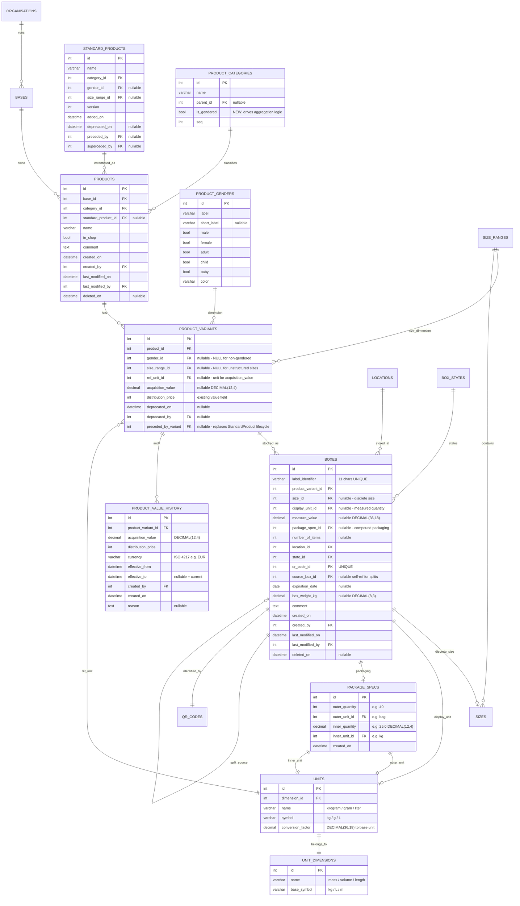
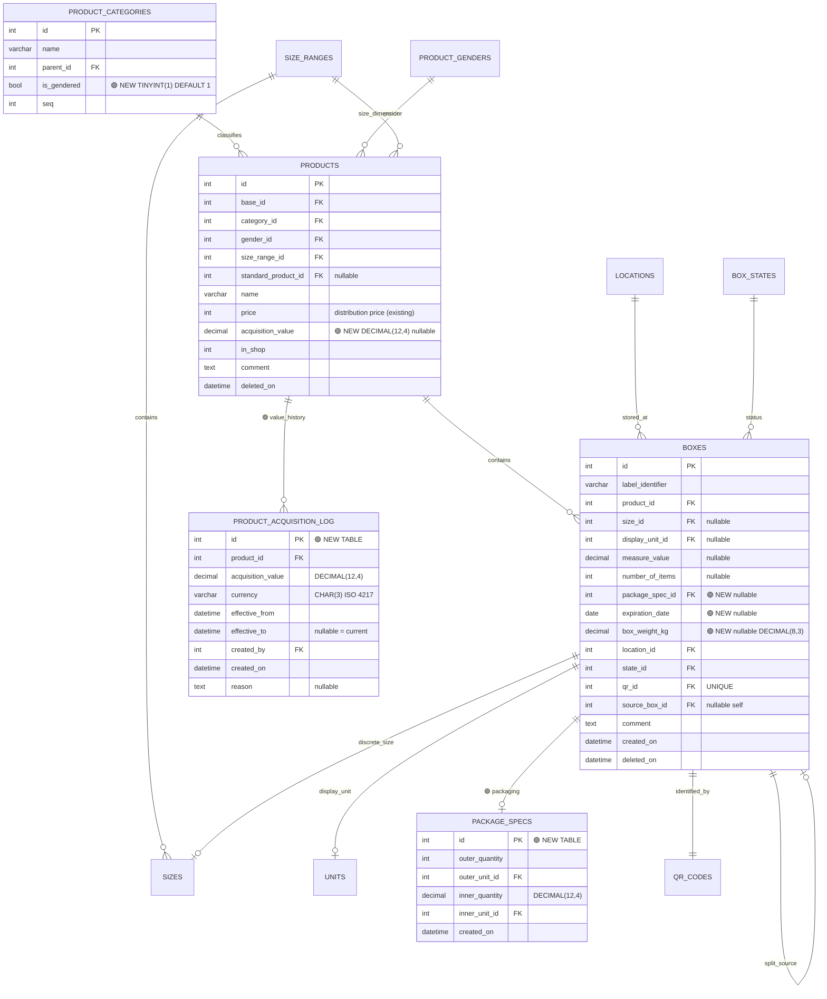
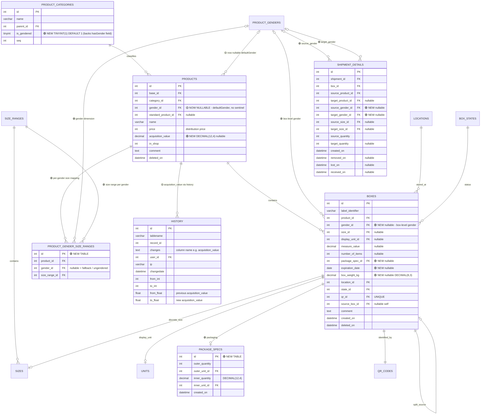

# Product Data Structure Investigation

## Executive Summary

Boxtribute's current data model was designed for clothing distribution and encodes several assumptions that limit its use for food, hygiene, and non-apparel humanitarian aid: gender is a first-class attribute of every product (not of the box or a variant), compound packaging (e.g. "40 bags of 25 kg") cannot be expressed, acquisition value and expiration dates are missing, and the gender-coupled product design makes statistical aggregation cumbersome.

Two designs are presented below. **Scenario 1 (Greenfield)** rebuilds the model from first principles, introduces a `ProductVariant` layer that decouples gender and size from the base product, adds full packaging metadata, audit-trail value history, and expiration tracking. It is the architecturally superior choice but requires ~380–560 hours of end-to-end work and carries higher migration risk. **Scenario 2 (Least Expensive Extension)** reaches the same functional goals through additive SQL changes—five new columns spread across two existing tables, two new tables, and no column renames—requiring ~80–130 hours and posing minimal migration risk. **The recommendation is Scenario 2 for the near term**, with Scenario 1's ProductVariant concept identified as the natural evolution target once Scenario 2 is stable.

---

## Scenario 1: Greenfield Approach

### ERD Diagram



### Data Structure Design

#### Core Concept: Product → ProductVariant → Box

The central restructuring is the introduction of **ProductVariant** as the intermediate layer between the product definition and individual box inventory:

- **Product**: "What is the thing?" — name, category, base, standard product linkage. No gender, no size range.
- **ProductVariant**: "Which specific variation?" — gender dimension, size range dimension, acquisition value, distribution price. A non-gendered product (rice) has one variant with `gender_id = NULL`. A gendered product (t-shirt) has multiple variants: men's, women's, boys'.
- **Box**: "Where is it and how much?" — links to a specific variant, records size (for discrete) or measure/package (for measured), expiration, weight.

This separation resolves the aggregation problem: statistics sum by `product_id` or `product_variant_id` as needed, no longer requiring a `GenderProductFilter` hack.

#### Package Specifications

A new `package_specs` table captures compound packaging:

| Field | Purpose |
|---|---|
| `outer_quantity` | How many outer containers (e.g., 40) |
| `outer_unit_id` | Container type (e.g., "bag", "tin", "bottle") |
| `inner_quantity` | Amount in each container (e.g., 25.0) |
| `inner_unit_id` | Inner unit (e.g., "kg", "g", "ml") |

"40 bags of 25 kg rice" → `outer_quantity=40, outer_unit=bag, inner_quantity=25, inner_unit=kg`.

A box with `package_spec_id` set would typically have `number_of_items = outer_quantity` and `measure_value = outer_quantity × inner_quantity` (in base units) for aggregation convenience.

#### Expiration and Weight on Box

- `expiration_date DATE` on `boxes` – nullable; required by business rule for food/hygiene categories.
- `box_weight_kg DECIMAL(8,3)` on `boxes` – nullable; can be computed from `measure_value` when dimension is "mass", otherwise manually entered.

When a box is split (via `source_box_id`), the child boxes inherit the parent's `expiration_date` at application layer, since the physical batch does not change.

#### Financial Audit Trail

`product_value_history` keeps a temporal log of both acquisition value and distribution price changes. The current row has `effective_to = NULL`. When a price changes, the current row is closed (`effective_to = NOW()`) and a new row is inserted. This supports point-in-time queries: "What was the acquisition value of product X in shipment S that occurred on date D?"

### Sample Data Mappings

#### T-shirts: 20 pieces, size M, men's

```
products: id=1, base_id=3, name="T-Shirt", category_id=1 (Clothing)

product_variants: id=10, product_id=1, gender_id=1 (Men), size_range_id=2 (S,M,L,XL),
                  ref_unit_id=NULL, acquisition_value=NULL, distribution_price=3

boxes: id=100, product_variant_id=10, size_id=5 (M), number_of_items=20,
       measure_value=NULL, display_unit_id=NULL, package_spec_id=NULL,
       expiration_date=NULL, box_weight_kg=NULL, location_id=12
```

#### Rice: 40 bags of 25 kg each

```
package_specs: id=1, outer_quantity=40, outer_unit_id=7 (bag), inner_quantity=25, inner_unit_id=1 (kg)

products: id=50, base_id=3, name="Rice", category_id=4 (Food)

product_variants: id=200, product_id=50, gender_id=NULL, size_range_id=NULL,
                  ref_unit_id=1 (kg), acquisition_value=0.75, distribution_price=0

boxes: id=500, product_variant_id=200, size_id=NULL,
       display_unit_id=1 (kg), measure_value=1000.0,    -- 40 × 25 kg = 1000 kg stored in base unit
       package_spec_id=1, number_of_items=40,
       expiration_date='2025-09-01', box_weight_kg=1000.3, location_id=12
```

#### Wet wipes: 112 packages, ~1344 items (variable pack sizes)

Because pack sizes vary, there is no single `inner_quantity`. The package_spec captures the nominal outer container count; a note field records the variation:

```
package_specs: id=2, outer_quantity=112, outer_unit_id=8 (package),
               inner_quantity=12, inner_unit_id=9 (item)   -- nominal; actual varies

products: id=51, name="Wet Wipes"

product_variants: id=201, product_id=51, gender_id=NULL, size_range_id=NULL,
                  acquisition_value=1.20, ref_unit_id=9 (item), distribution_price=0

boxes: id=501, product_variant_id=201, package_spec_id=2,
       number_of_items=1344,    -- actual total items counted
       measure_value=NULL, display_unit_id=NULL, size_id=NULL,
       comment="112 packages, sizes vary (10–14 wipes each)"
```

#### Second-hand clothing: 200 kg mixed sizes

```
products: id=2, name="Second-Hand Clothing (Mixed)", category_id=1

product_variants: id=11, product_id=2, gender_id=5 (Mixed),
                  size_range_id=3 (Mass),    -- SizeRange with unit dimension = mass
                  ref_unit_id=1 (kg), acquisition_value=0.50, distribution_price=0

boxes: id=101, product_variant_id=11, size_id=NULL,
       display_unit_id=1 (kg), measure_value=200.0,
       number_of_items=NULL, package_spec_id=NULL
```

### Migration from Legacy

#### Conceptual transformation

```
-- LEGACY Product (gender tightly coupled):
products: id=10, name="Rice", gender_id=8 (none/NoGender), size_range_id=20 (Mass),
          value=0, camp_id=3, category_id=4

-- NEW Product (no gender):
products_new: id=10, base_id=3, name="Rice", category_id=4, standard_product_id=NULL, in_shop=0

-- NEW ProductVariant (gender is a nullable dimension):
product_variants: id=auto, product_id=10, gender_id=NULL, size_range_id=20,
                  ref_unit_id=NULL, acquisition_value=NULL, distribution_price=0

---

-- LEGACY Box (gendered product, measured):
stock: id=500, product_id=10, size_id=22 (Mixed), measure_value=1000,
       display_unit_id=1 (kg), items=NULL

-- NEW Box (variant + no size needed for mass-measured box):
boxes: id=500, product_variant_id=<new_variant_id>, size_id=NULL,
       measure_value=1000, display_unit_id=1, number_of_items=NULL,
       package_spec_id=NULL, expiration_date=NULL, box_weight_kg=NULL
```

#### Migration steps

1. **Create new schema** alongside existing (no drops until cutover).
2. **Migrate ProductCategories**: add `is_gendered` column, populate from known categories (clothing=true, food/hygiene=false).
3. **Migrate Products**: for each legacy product, insert into `products_new` (strip gender/size_range), then create one `product_variant` row with the legacy gender and size_range. Map `value` → `distribution_price`. Map legacy "NoGender"/"Mixed gender" → `gender_id = NULL`.
4. **Migrate Boxes**: repoint `product_variant_id` using the mapping table from step 3. For boxes with `size_id` pointing to a "Mixed" size in a mass/volume range, set `size_id = NULL` (the `measure_value` is sufficient).
5. **Update ShipmentDetail**: add `source_product_variant_id` / `target_product_variant_id` columns; populate from product→variant mapping.
6. **Run dual-write period** (both old and new columns populated) until all consumers updated.
7. **Drop legacy columns** after validation.

### Database Schema (Greenfield — CREATE TABLE statements)

```sql
-- NOTE: Existing unchanged tables are omitted for brevity.
-- New/significantly modified tables only.

CREATE TABLE `product_variants` (
  `id`                  INT UNSIGNED NOT NULL AUTO_INCREMENT,
  `product_id`          INT UNSIGNED NOT NULL,
  `gender_id`           INT UNSIGNED DEFAULT NULL,  -- NULL = non-gendered
  `size_range_id`       INT UNSIGNED DEFAULT NULL,  -- NULL = no structured sizes
  `ref_unit_id`         INT UNSIGNED DEFAULT NULL,  -- unit for acquisition_value
  `acquisition_value`   DECIMAL(12,4) DEFAULT NULL,
  `distribution_price`  INT NOT NULL DEFAULT 0,
  `deprecated_on`       DATETIME DEFAULT NULL,
  `deprecated_by`       INT UNSIGNED DEFAULT NULL,
  `preceded_by_variant` INT UNSIGNED DEFAULT NULL,
  PRIMARY KEY (`id`),
  KEY `product_id` (`product_id`),
  KEY `gender_id` (`gender_id`),
  KEY `size_range_id` (`size_range_id`),
  KEY `ref_unit_id` (`ref_unit_id`),
  CONSTRAINT `fk_pv_product` FOREIGN KEY (`product_id`) REFERENCES `products` (`id`),
  CONSTRAINT `fk_pv_gender` FOREIGN KEY (`gender_id`) REFERENCES `genders` (`id`),
  CONSTRAINT `fk_pv_sizerange` FOREIGN KEY (`size_range_id`) REFERENCES `sizegroup` (`id`),
  CONSTRAINT `fk_pv_refunit` FOREIGN KEY (`ref_unit_id`) REFERENCES `units` (`id`),
  CONSTRAINT `fk_pv_preceded` FOREIGN KEY (`preceded_by_variant`) REFERENCES `product_variants` (`id`)
) ENGINE=InnoDB DEFAULT CHARSET=utf8mb4;

-- Modified products table (gender_id and sizegroup_id REMOVED, others preserved)
-- Shown here as a new table; migration would ALTER or CREATE-SELECT-DROP-RENAME
CREATE TABLE `products_v2` (
  `id`                  INT UNSIGNED NOT NULL AUTO_INCREMENT,
  `base_id`             INT UNSIGNED NOT NULL,
  `category_id`         INT UNSIGNED NOT NULL,
  `standard_product_id` INT UNSIGNED DEFAULT NULL,
  `name`                VARCHAR(255) NOT NULL,
  `in_shop`             TINYINT NOT NULL DEFAULT 0,
  `comment`             VARCHAR(255) DEFAULT NULL,
  `created_on`          DATETIME DEFAULT NULL,
  `created_by`          INT UNSIGNED DEFAULT NULL,
  `last_modified_on`    DATETIME DEFAULT NULL,
  `last_modified_by`    INT UNSIGNED DEFAULT NULL,
  `deleted_on`          DATETIME DEFAULT NULL,
  PRIMARY KEY (`id`),
  KEY `base_id` (`base_id`),
  KEY `category_id` (`category_id`),
  KEY `standard_product_id` (`standard_product_id`)
) ENGINE=InnoDB DEFAULT CHARSET=utf8mb4;

CREATE TABLE `package_specs` (
  `id`              INT UNSIGNED NOT NULL AUTO_INCREMENT,
  `outer_quantity`  INT UNSIGNED NOT NULL,
  `outer_unit_id`   INT UNSIGNED NOT NULL,
  `inner_quantity`  DECIMAL(12,4) NOT NULL,
  `inner_unit_id`   INT UNSIGNED NOT NULL,
  `created_on`      DATETIME NOT NULL DEFAULT CURRENT_TIMESTAMP,
  PRIMARY KEY (`id`),
  KEY `outer_unit_id` (`outer_unit_id`),
  KEY `inner_unit_id` (`inner_unit_id`),
  CONSTRAINT `fk_ps_outer_unit` FOREIGN KEY (`outer_unit_id`) REFERENCES `units` (`id`),
  CONSTRAINT `fk_ps_inner_unit` FOREIGN KEY (`inner_unit_id`) REFERENCES `units` (`id`)
) ENGINE=InnoDB DEFAULT CHARSET=utf8mb4;

-- Modified boxes/stock table
CREATE TABLE `stock_v2` (
  `id`                  INT UNSIGNED NOT NULL AUTO_INCREMENT,
  `label_identifier`    VARCHAR(11) NOT NULL DEFAULT '',
  `product_variant_id`  INT UNSIGNED NOT NULL,        -- replaces product_id + gender coupling
  `size_id`             INT UNSIGNED DEFAULT NULL,
  `display_unit_id`     INT UNSIGNED DEFAULT NULL,
  `measure_value`       DECIMAL(36,18) DEFAULT NULL,
  `package_spec_id`     INT UNSIGNED DEFAULT NULL,    -- NEW: compound packaging
  `number_of_items`     INT DEFAULT NULL,
  `location_id`         INT UNSIGNED NOT NULL,
  `state_id`            INT UNSIGNED NOT NULL DEFAULT 1,
  `qr_id`               INT UNSIGNED DEFAULT NULL,
  `source_box_id`       INT UNSIGNED DEFAULT NULL,
  `expiration_date`     DATE DEFAULT NULL,            -- NEW
  `box_weight_kg`       DECIMAL(8,3) DEFAULT NULL,    -- NEW
  `distro_event_id`     INT UNSIGNED DEFAULT NULL,
  `comment`             TEXT,
  `created_on`          DATETIME DEFAULT NULL,
  `created_by`          INT UNSIGNED DEFAULT NULL,
  `last_modified_on`    DATETIME DEFAULT NULL,
  `last_modified_by`    INT UNSIGNED DEFAULT NULL,
  `deleted_on`          DATETIME NOT NULL DEFAULT '0000-00-00 00:00:00',
  PRIMARY KEY (`id`),
  UNIQUE KEY `label_identifier_unique` (`label_identifier`),
  UNIQUE KEY `qr_id_unique` (`qr_id`),
  KEY `product_variant_id` (`product_variant_id`),
  KEY `location_id` (`location_id`),
  KEY `size_id` (`size_id`),
  KEY `state_id` (`state_id`),
  KEY `package_spec_id` (`package_spec_id`),
  KEY `expiration_date` (`expiration_date`),
  KEY `source_box_id` (`source_box_id`),
  CONSTRAINT `fk_stock_variant` FOREIGN KEY (`product_variant_id`) REFERENCES `product_variants` (`id`),
  CONSTRAINT `fk_stock_ps` FOREIGN KEY (`package_spec_id`) REFERENCES `package_specs` (`id`)
) ENGINE=InnoDB DEFAULT CHARSET=utf8mb4;

CREATE TABLE `product_value_history` (
  `id`                  INT UNSIGNED NOT NULL AUTO_INCREMENT,
  `product_variant_id`  INT UNSIGNED NOT NULL,
  `acquisition_value`   DECIMAL(12,4) DEFAULT NULL,
  `distribution_price`  INT NOT NULL DEFAULT 0,
  `currency`            CHAR(3) NOT NULL DEFAULT 'EUR',  -- ISO 4217
  `effective_from`      DATETIME NOT NULL,
  `effective_to`        DATETIME DEFAULT NULL,           -- NULL = current row
  `created_by`          INT UNSIGNED NOT NULL,
  `created_on`          DATETIME NOT NULL DEFAULT CURRENT_TIMESTAMP,
  `reason`              TEXT DEFAULT NULL,
  PRIMARY KEY (`id`),
  KEY `product_variant_id_eff` (`product_variant_id`, `effective_from`),
  KEY `effective_to` (`effective_to`),
  CONSTRAINT `fk_pvh_variant` FOREIGN KEY (`product_variant_id`) REFERENCES `product_variants` (`id`)
) ENGINE=InnoDB DEFAULT CHARSET=utf8mb4;

-- New column on product_categories
ALTER TABLE `product_categories`
  ADD COLUMN `is_gendered` TINYINT(1) NOT NULL DEFAULT 1 AFTER `parent_id`;
-- Backfill: food, hygiene, non-apparel categories set to 0

-- New unit_dimensions table (currently SizeRange doubles as dimension; separate cleanly)
CREATE TABLE `unit_dimensions` (
  `id`           INT UNSIGNED NOT NULL AUTO_INCREMENT,
  `name`         VARCHAR(50) NOT NULL,  -- 'mass', 'volume', 'length'
  `base_symbol`  VARCHAR(10) NOT NULL,  -- 'kg', 'L', 'm'
  PRIMARY KEY (`id`)
) ENGINE=InnoDB DEFAULT CHARSET=utf8mb4;
-- Migrate: units.dimension_id currently FK to sizegroup; point to unit_dimensions instead
```

#### Indexing strategy

| Table | Index | Rationale |
|---|---|---|
| `product_variants` | `(product_id, gender_id)` | Product variant lookup with gender filter |
| `stock_v2` | `(product_variant_id, state_id)` | InStock count aggregations |
| `stock_v2` | `(location_id, state_id)` | Location-level stock views |
| `stock_v2` | `expiration_date` | Expiry alerts and food safety queries |
| `product_value_history` | `(product_variant_id, effective_from)` | Point-in-time value lookups |
| `package_specs` | `(outer_unit_id, inner_unit_id)` | Unit-based filtering |

### Implementation Effort (Scenario 1)

```
Backend Changes:
- New/modified models: 6 (ProductVariant NEW, Box MODIFIED, Product MODIFIED,
  PackageSpec NEW, ProductValueHistory NEW, UnitDimension NEW)
- New/modified GraphQL types: 3 new (ProductVariant, PackageSpec, ProductValueHistory),
  ~12 modified (Box, Product, ShipmentDetail, all inputs)
- Modified GraphQL resolvers: ~25 (box CRUD, product CRUD, statistics, shipment)
- New GraphQL resolvers: ~6 (productVariant queries, value history, package spec CRUD)
- New/modified business logic modules: 5 (box service, product service,
  statistics aggregation, shipment reconciliation, value audit)
- Modified authorization rules: ~8 (all product/box scopes gain variant check)
Backend estimated hours: 180–260  (confidence: medium)

Frontend Changes:
- Modified components: BoxCreate, BoxEdit, BoxesFilter, BoxesTable, ProductsContainer,
  CreateCustomProductForm, all statistics/filter views using GenderProductFilter (~18 files)
- New components: PackageSpecInput, AcquisitionValueInput, ExpirationDateInput,
  ProductVariantSelector (~5 components)
- Updated GraphQL queries/fragments: ~20 files
Frontend estimated hours: 100–160  (confidence: medium)

Migration:
- Migration scripts needed: 5 (category backfill, product split, variant creation,
  box repoint, shipment_detail update)
- Estimated downtime: 30–60 min (dependent on row count; ~1M boxes worst case)
- Rollback complexity: HIGH – schema changes to core tables require restoring
  from backup or maintaining parallel tables during transition period
Migration estimated hours: 40–60  (confidence: low)

Testing & QA:
- Unit/integration tests: ~40 hours
- Manual QA of all affected flows: ~20 hours
Testing estimated hours: 40–60  (confidence: medium)

TOTAL: 360–540 hours
```

### Advantages

- ✅ **Clean aggregation**: Statistics group by `product_id` naturally. Non-gendered products (food, hygiene) aggregate without filter gymnastics because `gender_id` is NULL rather than a sentinel value.
- ✅ **Extensible variants**: Adding new product dimensions (e.g., color, material, condition) requires only new columns on `product_variants`, not schema redesign.
- ✅ **Rich financial tracking**: `product_value_history` provides a complete audit log of acquisition and distribution price changes, enabling cost-of-aid reports and donor reporting.
- ✅ **Full compound unit support**: `package_specs` handles nested packaging (bags of kg, tins of g, bottles of ml) with precision and queryable structure.
- ✅ **Future-proof for food safety**: `expiration_date` on the box and `box_weight_kg` enable logistics weight calculations and food safety recalls.

### Drawbacks

- ⚠️ **Large migration scope**: The `products → product_variants → boxes` refactor touches every consumer: API, frontend, statistics, shipments, distribution events.
- ⚠️ **GraphQL breaking changes**: All resolvers returning `Product` fields (`gender`, `sizeRange`) change shape. Deprecation wrappers are needed for backwards compatibility during transition.
- ⚠️ **ShipmentDetail complexity**: `source_product_id`/`target_product_id` must become `source_product_variant_id`/`target_product_variant_id`, affecting cross-base product reconciliation logic.
- ⚠️ **Higher ongoing complexity**: Developers must understand the Product/ProductVariant distinction. Queries that were simple product-gender joins become slightly more layered.
- ⚠️ **Risk of partial migration failures**: A failed mid-migration leaves data in an inconsistent state; rollback from a partial ProductVariant population is complex.

### Tradeoffs

- 🔄 **You gain** a clean, scalable model where gender and size are true dimensions rather than forced attributes. **You sacrifice** ~6 months of development velocity during migration.
- 🔄 **You gain** first-class financial audit capability. **You sacrifice** backwards-compatible GraphQL responses (deprecated fields must be maintained for ~1 release cycle).
- 🔄 **You gain** the ability to add new product dimensions without schema changes. **You sacrifice** simplicity: every box lookup now requires a JOIN through `product_variants`.

---

## Scenario 2: Least Expensive Extension

### ERD Diagram

> **Legend**: 🟢 NEW table/column, 🟡 MODIFIED column/behavior. All other entities are unchanged.



### Data Structure Design

#### Philosophy: additive-only changes

Every existing column, table, and foreign key is preserved as-is. All new functionality is introduced by:

1. **Two new columns on `products`**: `acquisition_value` (monetary worth) and the `is_gendered` flag on `product_categories`.
2. **Three new columns on `stock`**: `package_spec_id`, `expiration_date`, `box_weight_kg`.
3. **Two new tables**: `package_specs` (compound packaging) and `product_acquisition_log` (value audit trail).

No renames. No column drops. No existing FK changes. Existing API resolvers need no changes for unrelated features.

#### Non-gendered aggregation (without restructuring)

Adding `is_gendered TINYINT(1)` to `product_categories` is sufficient to fix the statistics aggregation problem:

- In statistics queries, `GROUP BY gender` only when the product's category has `is_gendered = 1`.
- The existing `GenderProductFilter` in the statistics module gains an `is_gendered` check before applying gender grouping.
- No product data migration needed — the `gender_id` on products remains; it is simply ignored during aggregation for non-gendered categories.

#### Acquisition value placement

`acquisition_value` is placed on the `products` table as one price for the whole product (not per size/gender). This is the minimum viable approach:

- Products with different sizes that have radically different per-unit values can still be differentiated by creating separate product records per size (the current practice).
- A `product_acquisition_log` table records changes over time for the audit trail.
- If per-size acquisition value is later needed, `acquisition_value` can be added to a `product_sizes` table in a subsequent iteration.

### Sample Data Mappings

#### T-shirts: 20 pieces, size M, men's

No change from current structure:

```
products:  id=1, name="T-Shirt", gender_id=1 (Men), size_range_id=2 (S,M,L,XL),
           acquisition_value=2.50  ← NEW

stock:     id=100, product_id=1, size_id=5 (M), number_of_items=20,
           measure_value=NULL, display_unit_id=NULL, package_spec_id=NULL,
           expiration_date=NULL, box_weight_kg=NULL
```

#### Rice: 40 bags of 25 kg each

```
package_specs: id=1, outer_quantity=40, outer_unit_id=7 (bag),
               inner_quantity=25.0, inner_unit_id=1 (kg)

products:  id=50, name="Rice", gender_id=8 (NoGender), size_range_id=20 (Mass),
           acquisition_value=0.75    ← per kg

stock:     id=500, product_id=50, size_id=22 (Mixed), measure_value=1000.0,
           display_unit_id=1 (kg), number_of_items=40,
           package_spec_id=1,        ← NEW: links to package_specs
           expiration_date='2025-09-01',  ← NEW
           box_weight_kg=1000.3      ← NEW
```

#### Wet wipes: 112 packages, ~1344 items

```
package_specs: id=2, outer_quantity=112, outer_unit_id=8 (package),
               inner_quantity=12.0, inner_unit_id=9 (item)  -- nominal; actual varies

products:  id=51, name="Wet Wipes", gender_id=8 (NoGender),
           size_range_id=1 (OneSize), acquisition_value=1.20

stock:     id=501, product_id=51, size_id=3 (OneSize/Mixed), number_of_items=1344,
           package_spec_id=2,         ← nominal 12-per-package spec
           measure_value=NULL, display_unit_id=NULL,
           comment="112 packages, variable sizes (actual items counted: 1344)"
```

#### Second-hand clothing: 200 kg mixed sizes

No change from current structure (already supported via Mass SizeRange):

```
products:  id=2, name="Second-Hand Clothing (Mixed)", gender_id=9 (Mixed),
           size_range_id=3 (Mass), acquisition_value=0.50

stock:     id=101, product_id=2, size_id=22 (Mixed), measure_value=200.0,
           display_unit_id=1 (kg), number_of_items=NULL, package_spec_id=NULL
```

### Migration from Legacy

Migration is trivial because all existing data remains valid. The new columns are nullable, so no backfill is required for existing rows. Changes are purely additive:

```sql
-- LEGACY Box: fully valid after migration, all queries still work unchanged
stock: id=500, product_id=10, size_id=22, measure_value=1000, display_unit_id=1, items=NULL

-- NEW Box: same row, new columns default NULL - backward compatible
stock: id=500, product_id=10, size_id=22, measure_value=1000, display_unit_id=1, items=NULL,
       package_spec_id=NULL,    -- no packaging metadata yet (can be filled later)
       expiration_date=NULL,    -- no expiry known
       box_weight_kg=NULL       -- not yet recorded
```

For new boxes (rice, wet wipes), the application layer populates the new columns via updated API inputs; old mobile clients that don't send these fields will get NULL values.

#### Backfill strategy (optional, low priority)

```sql
-- Set is_gendered = 0 for non-apparel categories
UPDATE product_categories
SET is_gendered = 0
WHERE name IN ('Food', 'Hygiene', 'Toiletries', 'Medical', 'School Supplies',
               'Household Items', 'Cleaning Products');

-- acquisition_value can be backfilled from external spreadsheet import
-- No automated backfill needed; organizations enter values going forward
```

### Database Schema (Least Expensive — ALTER statements)

```sql
-- ─────────────────────────────────────────────────────────────────────────────
-- 1. product_categories: add is_gendered flag
-- ─────────────────────────────────────────────────────────────────────────────
ALTER TABLE `product_categories`
  ADD COLUMN `is_gendered` TINYINT(1) NOT NULL DEFAULT 1
  COMMENT 'When 0, gender dimension is ignored in statistics aggregation'
  AFTER `parent_id`;

-- Backfill known non-gendered categories (adjust IDs per environment)
UPDATE `product_categories` SET `is_gendered` = 0
WHERE `label` IN ('Food','Hygiene','Toiletries','Medical',
                  'Cleaning Products','Household Items','School Supplies');

-- ─────────────────────────────────────────────────────────────────────────────
-- 2. products: add acquisition_value
-- ─────────────────────────────────────────────────────────────────────────────
ALTER TABLE `products`
  ADD COLUMN `acquisition_value` DECIMAL(12,4) DEFAULT NULL
  COMMENT 'Stock acquisition cost per ref unit (currency = base currency_name)'
  AFTER `value`;

-- ─────────────────────────────────────────────────────────────────────────────
-- 3. New table: package_specs
-- ─────────────────────────────────────────────────────────────────────────────
CREATE TABLE `package_specs` (
  `id`              INT UNSIGNED NOT NULL AUTO_INCREMENT,
  `outer_quantity`  INT UNSIGNED NOT NULL
                    COMMENT 'Number of outer containers, e.g. 40',
  `outer_unit_id`   INT UNSIGNED NOT NULL
                    COMMENT 'FK to units - type of outer container, e.g. bag',
  `inner_quantity`  DECIMAL(12,4) NOT NULL
                    COMMENT 'Amount per container, e.g. 25.0',
  `inner_unit_id`   INT UNSIGNED NOT NULL
                    COMMENT 'FK to units - unit of inner content, e.g. kg',
  `created_on`      DATETIME NOT NULL DEFAULT CURRENT_TIMESTAMP,
  PRIMARY KEY (`id`),
  KEY `outer_unit_id` (`outer_unit_id`),
  KEY `inner_unit_id` (`inner_unit_id`),
  CONSTRAINT `fk_ps_outer` FOREIGN KEY (`outer_unit_id`) REFERENCES `units` (`id`),
  CONSTRAINT `fk_ps_inner` FOREIGN KEY (`inner_unit_id`) REFERENCES `units` (`id`)
) ENGINE=InnoDB DEFAULT CHARSET=utf8mb4
  COMMENT='Compound packaging specifications (e.g. 40 bags x 25kg)';

-- ─────────────────────────────────────────────────────────────────────────────
-- 4. stock: add package_spec_id, expiration_date, box_weight_kg
-- ─────────────────────────────────────────────────────────────────────────────
ALTER TABLE `stock`
  ADD COLUMN `package_spec_id`  INT UNSIGNED DEFAULT NULL
    COMMENT 'FK to package_specs - compound packaging metadata'
    AFTER `source_box_id`,
  ADD COLUMN `expiration_date`  DATE DEFAULT NULL
    COMMENT 'Best-before or expiry date for perishables'
    AFTER `package_spec_id`,
  ADD COLUMN `box_weight_kg`    DECIMAL(8,3) DEFAULT NULL
    COMMENT 'Physical gross weight of box in kg (logistics)'
    AFTER `expiration_date`;

ALTER TABLE `stock`
  ADD KEY `package_spec_id` (`package_spec_id`),
  ADD KEY `expiration_date` (`expiration_date`),
  ADD CONSTRAINT `fk_stock_ps` FOREIGN KEY (`package_spec_id`)
    REFERENCES `package_specs` (`id`);

-- ─────────────────────────────────────────────────────────────────────────────
-- 5. New table: product_acquisition_log (financial audit trail)
-- ─────────────────────────────────────────────────────────────────────────────
CREATE TABLE `product_acquisition_log` (
  `id`                INT UNSIGNED NOT NULL AUTO_INCREMENT,
  `product_id`        INT UNSIGNED NOT NULL,
  `acquisition_value` DECIMAL(12,4) DEFAULT NULL,
  `distribution_price` INT NOT NULL DEFAULT 0,
  `currency`          CHAR(3) NOT NULL DEFAULT 'EUR'
                      COMMENT 'ISO 4217 currency code',
  `effective_from`    DATETIME NOT NULL,
  `effective_to`      DATETIME DEFAULT NULL
                      COMMENT 'NULL indicates the current active row',
  `created_by`        INT UNSIGNED NOT NULL,
  `created_on`        DATETIME NOT NULL DEFAULT CURRENT_TIMESTAMP,
  `reason`            TEXT DEFAULT NULL,
  PRIMARY KEY (`id`),
  KEY `product_effective` (`product_id`, `effective_from`),
  KEY `effective_to` (`effective_to`),
  CONSTRAINT `fk_pal_product` FOREIGN KEY (`product_id`) REFERENCES `products` (`id`)
) ENGINE=InnoDB DEFAULT CHARSET=utf8mb4
  COMMENT='Temporal log of acquisition value and distribution price changes';

-- ─────────────────────────────────────────────────────────────────────────────
-- 6. Populate initial acquisition log rows for existing products with a value
-- ─────────────────────────────────────────────────────────────────────────────
INSERT INTO `product_acquisition_log`
  (`product_id`, `acquisition_value`, `distribution_price`, `currency`,
   `effective_from`, `created_by`, `created_on`)
SELECT `id`, NULL, `value`, 'EUR', NOW(), 1, NOW()
FROM `products`
WHERE `deleted` IS NULL OR `deleted` = '0000-00-00 00:00:00';
-- Note: created_by=1 is a placeholder; use a system user ID
```

#### Indexing strategy

| Table | New index | Rationale |
|---|---|---|
| `stock` | `expiration_date` | Alert queries ("expires within 30 days") |
| `stock` | `package_spec_id` | Package metadata joins |
| `product_acquisition_log` | `(product_id, effective_from)` | Point-in-time lookup |
| `product_categories` | *(no new index needed)* | Small table, full scan acceptable |

### Implementation Effort (Scenario 2)

```
Backend Changes:
- Modified models: 2 (Box: 3 new fields; Product: 1 new field)
- New models: 2 (PackageSpec, ProductAcquisitionLog)
- Modified ProductCategory model: 1 new field + logic in statistics resolvers
- New/modified GraphQL types: 2 new (PackageSpec, ProductAcquisitionLog),
  2 modified (Box type + BoxCreationInput/BoxUpdateInput, Product type)
- New GraphQL resolvers: 3 (packageSpec CRUD, productAcquisitionLog query)
- Modified GraphQL resolvers: 4 (box create/update to accept new fields,
  product create/edit to accept acquisition_value, statistics to use is_gendered)
- Modified business logic modules: 2 (box service for new fields, stats aggregation)
Backend estimated hours: 30–50  (confidence: high)

Frontend Changes:
- Modified components: BoxCreate (add expiration date + weight inputs),
  BoxEdit (same), BoxesFilter (add expiry filter), ProductsContainer
  (show acquisition value), CreateCustomProductForm (add acquisition value input)
  (~5 files)
- New components: PackageSpecInput (compound packaging form control) (~1 component)
- Updated GraphQL queries/fragments: ~8 files
Frontend estimated hours: 25–45  (confidence: high)

Migration:
- Migration scripts needed: 2 (5 ALTER statements + 2 CREATE TABLE, grouped into
  one forward migration; plus category backfill script)
- Estimated downtime: < 5 min (all ALTERs are ADD COLUMN on existing tables;
  MySQL instant ADD COLUMN for InnoDB in 8.0+)
- Rollback complexity: LOW – DROP COLUMN + DROP TABLE; no data transformation
Migration estimated hours: 5–10  (confidence: high)

Testing & QA:
- Backend test updates: ~15 hours
- Frontend test updates: ~10 hours
- Manual QA: ~5 hours
Testing estimated hours: 20–30  (confidence: high)

TOTAL: 80–135 hours
```

### Advantages

- ✅ **Minimal risk**: All changes are additive. Every existing API call, frontend query, and mobile client continues to work unchanged. New fields are nullable with sensible defaults.
- ✅ **Fast delivery**: ~80–135 hours versus ~360–540 hours. New functionality can ship within one sprint.
- ✅ **Zero data migration risk**: No existing rows are modified; rollback is `DROP COLUMN / DROP TABLE`.
- ✅ **Preserves all existing authorization patterns**: All product/box access is still scoped to `base_id`; no new scope checks needed.
- ✅ **Compound units in a clean structure**: `package_specs` is a proper relational table, not a JSON blob or concatenated string. It is queryable and extensible.

### Drawbacks

- ⚠️ **Gender-product coupling persists**: Gender remains on Product rather than Box. The aggregation fix (`is_gendered` on category) is pragmatic but not architecturally clean. Products with the same name but different genders (e.g., "T-Shirt Men" vs. "T-Shirt Women") remain as separate product rows.
- ⚠️ **Acquisition value is product-wide, not per-size**: A men's XL t-shirt and a men's S t-shirt have the same `acquisition_value`. Edge cases requiring per-size pricing cannot be served without further extension.
- ⚠️ **"Mixed" size UX confusion not resolved**: The "Mixed" size in every SizeRange is still present. Addressed by UX filtering rules, not schema changes.
- ⚠️ **Accrues technical debt**: The `gender_id` on products becomes progressively more awkward as non-apparel products grow. Scenario 1 will still need to be executed eventually.
- ⚠️ **Standard product versioning unchanged**: The `deprecated_on` / `preceded_by_product` lifecycle complexity on `StandardProduct` is not addressed.

### Tradeoffs

- 🔄 **You gain** working features this sprint. **You sacrifice** a clean data model that may require a larger refactor in 1–2 years.
- 🔄 **You gain** zero migration risk. **You sacrifice** the ability to record acquisition value per size/gender variant without another schema change.
- 🔄 **You gain** backwards-compatible GraphQL. **You sacrifice** the architectural opportunity to decouple gender from products while the codebase is still relatively small.

---

## Scenario 3: Targeted Gender-Decoupled Extension

> **Built on top of Scenario 2.** All additive changes from Scenario 2 are included. Two additional structural changes are applied: (a) gender is moved from a mandatory product attribute to an optional box-level attribute, and (b) the `product_acquisition_log` table is omitted — acquisition value history is derived from the existing `history` table.
>
> **Note on `hasGender` vs `is_gendered`:** The backend already exposes a `ProductCategory.hasGender: Boolean!` GraphQL field, currently implemented as a computed property (`parent_id == 12`). Scenario 3 replaces this hardcoded derivation with an actual `is_gendered TINYINT(1)` DB column, allowing category-level gender applicability to be queryable in SQL, overridable per category, and extensible without code changes.

### ERD Diagram

> **Legend**: 🟢 NEW table/column (includes all Scenario 2 additions), 🟡 MODIFIED column, 🔴 REMOVED constraint. All other entities are unchanged.



### Data Structure Design

#### Core Concept: Gender as a Box-Level Attribute

The key structural change in Scenario 3 is moving gender from a mandatory, non-nullable attribute of `products` to an optional attribute of `stock` (boxes). This decoupling has three concrete effects:

1. **Products become gender-neutral definitions.** A product named "T-Shirt" is created once without a required gender. The product's `gender_id` becomes nullable — it may still be set as a `defaultGender` (coordinator's convenience for pre-filling the box form), but it is no longer the authoritative source.

2. **Boxes carry gender as an optional inventory attribute.** When creating a box of T-Shirts, the coordinator specifies the gender (Men, Women, etc.) on the box itself. For food or hygiene products, `stock.gender_id` is NULL and `products.gender_id` is NULL — no sentinel `NoGender` row required.

3. **Effective gender resolution.** Anywhere the system needs a box's gender — statistics aggregations, shipment reconciliation, filter queries — it uses:
   ```sql
   COALESCE(stock.gender_id, products.gender_id)
   ```
   Box-level gender takes precedence; if absent, the product-level default gender acts as a fallback. This provides full backwards compatibility: existing products with `gender_id` set continue to work without any data migration.

#### Required: `product_gender_size_ranges` Junction Table

The `sizegroup` table (ORM: `SizeRange`) has **no `gender_id` column**. Instead, separate sizegroup rows already encode gender semantics by naming convention:

| sizegroup.id | label | sizes |
|---|---|---|
| 3 | Shoe sizes Female | 34, 35, 36, 37, 38, 39, 40, 41, "42+" |
| 8 | Shoe sizes Male | "38-", 39, 40, 41, 42, 43, 44, 45, "46+" |
| 9 | Shoe sizes children | 20–36+ |

Currently this is encoded in the product rows: `products("Shoes Men", gender_id=2, size_range_id=8)` and `products("Shoes Women", gender_id=1, size_range_id=3)`. After merging these into a single "Shoes" product, the link between gender and the correct size range would be lost.

The `product_gender_size_ranges` junction table preserves this mapping explicitly:

```sql
CREATE TABLE `product_gender_size_ranges` (
  `id`            INT UNSIGNED NOT NULL AUTO_INCREMENT,
  `product_id`    INT UNSIGNED NOT NULL,
  `gender_id`     INT UNSIGNED DEFAULT NULL  -- NULL = default / ungendered
                  COMMENT 'NULL row is the fallback when no gender matches',
  `size_range_id` INT UNSIGNED NOT NULL,
  PRIMARY KEY (`id`),
  UNIQUE KEY `ux_product_gender` (`product_id`, `gender_id`),
  FOREIGN KEY (`product_id`)    REFERENCES `products`(`id`),
  FOREIGN KEY (`gender_id`)     REFERENCES `genders`(`id`)  ON UPDATE CASCADE,
  FOREIGN KEY (`size_range_id`) REFERENCES `sizegroup`(`id`) ON UPDATE CASCADE
) ENGINE=InnoDB;
```

**Size-range resolution logic (used by BoxCreate/BoxEdit):**

```sql
-- Returns the most specific size range for a (product, gender) combination.
-- Exact gender match takes priority; NULL row is the fallback.
SELECT pgsr.size_range_id
FROM product_gender_size_ranges pgsr
WHERE pgsr.product_id = :product_id
  AND (pgsr.gender_id = :box_gender_id OR pgsr.gender_id IS NULL)
ORDER BY pgsr.gender_id IS NULL ASC   -- exact match first
LIMIT 1;
```

**Backfill migration** — every existing product maps to exactly one row:

```sql
INSERT INTO product_gender_size_ranges (product_id, gender_id, size_range_id)
SELECT id, gender_id, size_range_id FROM products WHERE deleted_on IS NULL;
```

After backfill, `products.size_range_id` is kept as a legacy column (not dropped) to avoid foreign key cascade complexity; it can be deprecated at leisure.

**GraphQL API change:**

```graphql
type Product {
  defaultGender: ProductGender           # was: gender (nullable)
  sizeRanges: [ProductGenderSizeRange!]! # NEW: replaces single sizeRange
  sizeRange: SizeRange                   # kept for backwards compat; returns fallback row
}

type ProductGenderSizeRange {
  gender: ProductGender   # null = default/ungendered
  sizeRange: SizeRange!
}
```

#### `product_categories.is_gendered` — Backing the existing `hasGender` field

The backend already exposes `ProductCategory.hasGender: Boolean!` via this resolver:

```python
@product_category.field("hasGender")
def resolve_product_category_has_gender(product_category_obj, _):
    return product_category_obj.parent_id == 12   # hardcoded to Clothing subtree
```

Scenario 3 replaces the hardcoded `parent_id == 12` with a real DB column `is_gendered TINYINT(1)`. The resolver body becomes `return product_category_obj.is_gendered`. The GraphQL field name `hasGender` is unchanged — this is a purely internal refactor.

**Why a DB column matters:**

- Statistics SQL queries can `JOIN product_categories ON pc.is_gendered = 1` to exclude non-gendered rows from gender aggregations, instead of post-processing a NoGender sentinel group.
- BoxCreate/BoxEdit can hide the gender selector for food/hygiene products using `category.hasGender` without a hardcoded client-side mapping.
- `GenderProductFilter` (statistics) can be hidden automatically when all queried categories have `is_gendered = 0`.
- New categories (e.g. "Sporting Goods") can be flagged `is_gendered = 1` with a data change, not a code change.

**Backfill migration:**

```sql
ALTER TABLE product_categories ADD COLUMN is_gendered TINYINT(1) NOT NULL DEFAULT 0;
-- Set all existing clothing subcategories (parent_id=12) as gendered:
UPDATE product_categories SET is_gendered = 1 WHERE parent_id = 12;
```

#### Acquisition Value History via the Existing `history` Table

Boxtribute already maintains a generic `history` table (`DbChangeHistory` ORM model) that records field-level changes to any table. The existing `save_update_to_history` decorator (already wrapping `edit_custom_product`, tracking `Product.gender`, `Product.name`, etc.) automatically writes a `history` row on every change. No new code is needed for the audit trail mechanism — only `acquisition_value` needs to be added to the tracked fields list.

```python
@save_update_to_history(
    fields=[
        Product.category,
        Product.size_range,
        Product.gender,
        Product.name,
        Product.price,
        Product.comment,
        Product.in_shop,
        Product.acquisition_value,   # ADD: tracked automatically via decorator
    ]
)
def edit_custom_product(...): ...
```

Query the audit trail:

```sql
SELECT changedate, from_float AS previous_value, to_float AS new_value, user_id
FROM history
WHERE tablename = 'products'
  AND record_id = :product_id
  AND changes = 'acquisition_value'
ORDER BY changedate;
```

**Precision note**: `history.from_float`/`to_float` are MySQL `FLOAT` (single-precision, ~7 significant digits). For acquisition values such as €0.75/kg or €1.20/item this is fully adequate. The limitation versus `DECIMAL(12,4)` is relevant only for values requiring more than 7 significant digits, which is not a realistic humanitarian-aid use case.

#### ShipmentDetail Gender Tracking

When a box is added to a shipment, the `source_gender_id` is captured as a snapshot in `shipment_detail` (mirroring the existing `source_size_id`/`target_size_id` pattern). This prevents ambiguity if a box's gender attribute is later edited and maintains a complete picture of what was sent vs. received. In the reconciliation UI (`MatchProductsForm`), the currently combined "Sender Product & Gender" block is split into separate "Sender Product" and "Sender Gender" fields, and a `targetGender` selector is added for the receiving base — exactly mirroring the existing `targetProduct` selector pattern.

For pre-migration shipments, `sourceGender` is NULL; the UI falls back to `sourceProduct.defaultGender` transparently.

### Sample Data Mappings

#### T-shirts: 20 pieces, size M, men's

Gender moves from the product to the box:

```
product_gender_size_ranges: (product_id=1, gender_id=NULL, size_range_id=1)
  -- T-Shirt uses XS–XXL for all genders; one fallback row is enough

products:  id=1, name="T-Shirt", gender_id=NULL,  ← no longer coupled
           category_id=3 (Tops), acquisition_value=2.50

stock:     id=100, product_id=1,
           gender_id=2 (Men),       ← NEW: gender at box level
           size_id=5 (M), number_of_items=20,
           measure_value=NULL, display_unit_id=NULL,
           package_spec_id=NULL, expiration_date=NULL, box_weight_kg=NULL
```

#### Shoes: 1 pair, size 42, men's

The per-gender size range mapping is now explicit:

```
product_gender_size_ranges: (product_id=10, gender_id=1 [Female], size_range_id=3)
                            (product_id=10, gender_id=2 [Male],   size_range_id=8)
                            (product_id=10, gender_id=6 [Kid],    size_range_id=9)

products:  id=10, name="Shoes", gender_id=NULL,   ← no longer coupled
           category_id=5 (Shoes), acquisition_value=5.00

stock:     id=102, product_id=10,
           gender_id=2 (Men),       ← box-level gender
           size_id=60 (42),         ← resolved via size range for Male (sizegroup 8)
           number_of_items=1
```

When BoxCreate loads this product with gender "Men" selected, the size options come from sizegroup 8 (Male shoe sizes 38–46). With gender "Women" selected, options come from sizegroup 3 (34–42). The `product_gender_size_ranges` table drives this lookup.

#### Rice: 40 bags of 25 kg each

No gender at either level — no sentinel row needed:

```
package_specs: id=1, outer_quantity=40, outer_unit_id=7 (bag),
               inner_quantity=25.0, inner_unit_id=1 (kg)

products:  id=50, name="Rice", gender_id=NULL,   ← truly no gender
           category_id=4 (Food), size_range_id=20 (Mass),
           acquisition_value=0.75

stock:     id=500, product_id=50,
           gender_id=NULL,           ← no gender
           size_id=22 (Mixed), measure_value=1000.0,
           display_unit_id=1 (kg), number_of_items=40,
           package_spec_id=1,
           expiration_date='2025-09-01', box_weight_kg=1000.3
```

#### Wet wipes: 112 packages, ~1344 items

```
package_specs: id=2, outer_quantity=112, outer_unit_id=8 (package),
               inner_quantity=12.0, inner_unit_id=9 (item)

products:  id=51, name="Wet Wipes", gender_id=NULL,
           category_id=5 (Hygiene), acquisition_value=1.20

stock:     id=501, product_id=51, gender_id=NULL,
           package_spec_id=2, number_of_items=1344,
           comment="112 packages, variable sizes (actual items counted: 1344)"
```

#### Second-hand clothing: 200 kg mixed sizes

Gender remains meaningful at box level:

```
products:  id=2, name="Second-Hand Clothing (Mixed)",
           gender_id=NULL,           ← or set to 3 (UnisexAdult) as product default
           size_range_id=3 (Mass), acquisition_value=0.50

stock:     id=101, product_id=2,
           gender_id=3 (UnisexAdult),  ← explicit at box level
           size_id=22 (Mixed), measure_value=200.0,
           display_unit_id=1 (kg)
```

### Migration from Legacy

#### Complete legacy-to-Scenario-3 transformation

```
-- LEGACY Product (gender tightly coupled, sentinel NoGender):
products: id=50, name="Rice", gender_id=10 (-/NoGender), size_range_id=20,
          value=0, camp_id=3

-- NEW Product (nullable gender, acquisition value added):
products: id=50, name="Rice", gender_id=NULL,   ← 10 → NULL
          size_range_id=20, value=0, acquisition_value=0.75, camp_id=3

---

-- LEGACY Box (gender comes only from product):
stock: id=500, product_id=50, size_id=22 (Mixed), measure_value=1000,
       display_unit_id=1 (kg), items=NULL

-- NEW Box (gender on box; NULL because food has no gender):
stock: id=500, product_id=50,
       gender_id=NULL,              ← no gender on box or product
       size_id=22 (Mixed), measure_value=1000,
       display_unit_id=1 (kg), items=NULL,
       package_spec_id=NULL, expiration_date=NULL, box_weight_kg=NULL
```

#### Migration steps

All schema changes are additive except making `gender_id` nullable. No row deletions are required. Steps 1–2 are the forward migration script; steps 3–5 are optional data cleanup that can run as background jobs.

**Step 1 — Schema changes** (single migration script, < 5 min):
```sql
-- Scenario 2 changes first (acquisition_value, package_specs, is_gendered on categories,
-- expiration_date, box_weight_kg, package_spec_id on stock)

-- S3: Make products.gender_id nullable
ALTER TABLE products MODIFY COLUMN gender_id INT UNSIGNED DEFAULT NULL;

-- S3: Add is_gendered to product_categories (backs hasGender GraphQL field)
ALTER TABLE product_categories ADD COLUMN is_gendered TINYINT(1) NOT NULL DEFAULT 0;
UPDATE product_categories SET is_gendered = 1 WHERE parent_id = 12;

-- S3: Create product_gender_size_ranges junction table
CREATE TABLE product_gender_size_ranges (
  id            INT UNSIGNED NOT NULL AUTO_INCREMENT,
  product_id    INT UNSIGNED NOT NULL,
  gender_id     INT UNSIGNED DEFAULT NULL,
  size_range_id INT UNSIGNED NOT NULL,
  PRIMARY KEY (id),
  UNIQUE KEY ux_product_gender (product_id, gender_id),
  FOREIGN KEY (product_id)    REFERENCES products(id)  ON UPDATE CASCADE,
  FOREIGN KEY (gender_id)     REFERENCES genders(id)   ON UPDATE CASCADE,
  FOREIGN KEY (size_range_id) REFERENCES sizegroup(id) ON UPDATE CASCADE
) ENGINE=InnoDB DEFAULT CHARSET=utf8;

-- Backfill from existing products (one row per product)
INSERT INTO product_gender_size_ranges (product_id, gender_id, size_range_id)
SELECT id, gender_id, size_range_id FROM products WHERE deleted_on IS NULL;

-- S3: Add gender_id to stock (box level)
ALTER TABLE stock ADD COLUMN gender_id INT UNSIGNED DEFAULT NULL AFTER product_id;
ALTER TABLE stock ADD KEY gender_id (gender_id);
ALTER TABLE stock ADD CONSTRAINT fk_stock_gender FOREIGN KEY (gender_id) REFERENCES genders(id);

-- S3: Add gender columns to shipment_detail
ALTER TABLE shipment_detail
  ADD COLUMN source_gender_id INT UNSIGNED DEFAULT NULL,
  ADD COLUMN target_gender_id INT UNSIGNED DEFAULT NULL;
ALTER TABLE shipment_detail
  ADD KEY source_gender_id (source_gender_id),
  ADD KEY target_gender_id (target_gender_id),
  ADD CONSTRAINT fk_sd_src_gender FOREIGN KEY (source_gender_id) REFERENCES genders(id),
  ADD CONSTRAINT fk_sd_tgt_gender FOREIGN KEY (target_gender_id) REFERENCES genders(id);
```

**Step 2 — Data backfill of NoGender sentinel** (optional, zero-risk):
```sql
-- Remove the NoGender sentinel (id=10, label='-') from products
-- that have it set. These products genuinely have no gender.
UPDATE products SET gender_id = NULL
WHERE gender_id = 10;  -- id 10 = '-' (NoGender sentinel row)
```
This is optional but strongly recommended to clean up existing data. It has no effect on any FK or query — the COALESCE logic handles NULL correctly.

**Step 3 — Populate box-level gender from product** (optional, gradual):
```sql
-- For existing boxes whose product has a non-null gender, copy it to box level.
-- This makes gender explicit at box level for old data.
-- Run as a background job to avoid locking.
UPDATE stock s
JOIN products p ON s.product_id = p.id
SET s.gender_id = p.gender_id
WHERE s.gender_id IS NULL AND p.gender_id IS NOT NULL;
```
This step is **optional and can be deferred**. The COALESCE fallback means old boxes without `stock.gender_id` continue to use their product's gender correctly.

**Step 4 — Product consolidation** (optional, application-driven):
For cases where the same item exists as separate gendered products (e.g. "T-Shirt Men" id=1 and "T-Shirt Women" id=2), they can be merged into a single "T-Shirt" product over time:
- Create new product "T-Shirt" with `gender_id=NULL`
- Re-assign boxes: `UPDATE stock SET product_id=<new_id>, gender_id=<original_gender> WHERE product_id IN (1,2)`
- Soft-delete old products: `UPDATE products SET deleted=NOW() WHERE id IN (1,2)`
This is entirely optional and can happen product-by-product at the organisation's pace.

### Database Schema (Scenario 3 — ALTER statements)

All Scenario 2 ALTERs apply first. Scenario 3 adds the following:

```sql
-- ─────────────────────────────────────────────────────────────────────────────
-- S3-1. Back product_categories.hasGender with a real DB column
-- ─────────────────────────────────────────────────────────────────────────────
ALTER TABLE `product_categories`
  ADD COLUMN `is_gendered` TINYINT(1) NOT NULL DEFAULT 0
  COMMENT 'Backs the hasGender GraphQL field; replaces hardcoded parent_id==12 check';

-- Seed: all Clothing subcategories (parent_id=12) are gendered
UPDATE `product_categories` SET `is_gendered` = 1 WHERE `parent_id` = 12;

-- ─────────────────────────────────────────────────────────────────────────────
-- S3-2. Remove NOT NULL constraint from products.gender_id
-- ─────────────────────────────────────────────────────────────────────────────
ALTER TABLE `products`
  MODIFY COLUMN `gender_id` INT UNSIGNED DEFAULT NULL
  COMMENT 'Optional defaultGender; NULL for non-gendered products (food, hygiene)';

-- Recommended: clear NoGender sentinel (genders.id=10, label="-")
UPDATE `products` SET `gender_id` = NULL WHERE `gender_id` = 10;

-- ─────────────────────────────────────────────────────────────────────────────
-- S3-3. Create product_gender_size_ranges junction table
--       Maps each (product, gender) pair to the correct size range.
--       gender_id = NULL means "default / ungendered" (fallback row).
-- ─────────────────────────────────────────────────────────────────────────────
CREATE TABLE `product_gender_size_ranges` (
  `id`            INT UNSIGNED NOT NULL AUTO_INCREMENT,
  `product_id`    INT UNSIGNED NOT NULL,
  `gender_id`     INT UNSIGNED DEFAULT NULL
                  COMMENT 'NULL = fallback row used when no gender-specific row exists',
  `size_range_id` INT UNSIGNED NOT NULL,
  PRIMARY KEY (`id`),
  UNIQUE KEY `ux_product_gender` (`product_id`, `gender_id`),
  KEY `size_range_id` (`size_range_id`),
  CONSTRAINT `fk_pgsr_product`
    FOREIGN KEY (`product_id`) REFERENCES `products` (`id`) ON UPDATE CASCADE,
  CONSTRAINT `fk_pgsr_gender`
    FOREIGN KEY (`gender_id`) REFERENCES `genders` (`id`) ON UPDATE CASCADE,
  CONSTRAINT `fk_pgsr_sizerange`
    FOREIGN KEY (`size_range_id`) REFERENCES `sizegroup` (`id`) ON UPDATE CASCADE
) ENGINE=InnoDB DEFAULT CHARSET=utf8;

-- Backfill: every existing product maps to exactly one row
INSERT INTO `product_gender_size_ranges` (`product_id`, `gender_id`, `size_range_id`)
SELECT `id`, `gender_id`, `size_range_id`
FROM `products`
WHERE `deleted_on` IS NULL;

-- ─────────────────────────────────────────────────────────────────────────────
-- S3-4. Add gender_id to stock (box-level gender)
-- ─────────────────────────────────────────────────────────────────────────────
ALTER TABLE `stock`
  ADD COLUMN `gender_id` INT UNSIGNED DEFAULT NULL
  COMMENT 'Box-level gender; takes precedence over products.gender_id via COALESCE'
  AFTER `product_id`;

ALTER TABLE `stock`
  ADD KEY `gender_id` (`gender_id`),
  ADD CONSTRAINT `fk_stock_gender`
    FOREIGN KEY (`gender_id`) REFERENCES `genders` (`id`) ON UPDATE CASCADE;

-- ─────────────────────────────────────────────────────────────────────────────
-- S3-5. Add gender snapshot columns to shipment_detail
-- ─────────────────────────────────────────────────────────────────────────────
ALTER TABLE `shipment_detail`
  ADD COLUMN `source_gender_id` INT UNSIGNED DEFAULT NULL
    COMMENT 'Gender of box at time of shipment creation (COALESCE snapshot)'
    AFTER `source_size_id`,
  ADD COLUMN `target_gender_id` INT UNSIGNED DEFAULT NULL
    COMMENT 'Gender assigned at receiving base'
    AFTER `target_size_id`;

ALTER TABLE `shipment_detail`
  ADD KEY `source_gender_id` (`source_gender_id`),
  ADD KEY `target_gender_id` (`target_gender_id`),
  ADD CONSTRAINT `fk_sd_src_gender`
    FOREIGN KEY (`source_gender_id`) REFERENCES `genders` (`id`) ON UPDATE CASCADE,
  ADD CONSTRAINT `fk_sd_tgt_gender`
    FOREIGN KEY (`target_gender_id`) REFERENCES `genders` (`id`) ON UPDATE CASCADE;

-- ─────────────────────────────────────────────────────────────────────────────
-- S3-6. Acquisition value change tracking: no new table needed.
--       Add acquisition_value to the fields tracked by save_update_to_history.
--       Example query to retrieve history for a product:
--   SELECT changedate, from_float AS previous_value, to_float AS new_value, user_id
--   FROM history
--   WHERE tablename = 'products'
--     AND record_id = :product_id
--     AND changes = 'acquisition_value'
--   ORDER BY changedate;
-- ─────────────────────────────────────────────────────────────────────────────
```

#### Indexing strategy

Inherits all Scenario 2 indexes, plus:

| Table | New index | Rationale |
|---|---|---|
| `product_gender_size_ranges` | `(product_id, gender_id)` UNIQUE | Size range lookup by (product, gender) |
| `stock` | `gender_id` | Box-level gender filter in statistics and box listing |
| `stock` | `(product_id, gender_id, state_id)` | Composite for aggregation queries |
| `shipment_detail` | `source_gender_id`, `target_gender_id` | Reconciliation queries by gender |

#### GraphQL schema evolution

```graphql
# Product.gender renamed to defaultGender (nullable)
type Product {
  defaultGender: ProductGender          # was: gender
  sizeRanges: [ProductGenderSizeRange!]! # NEW: replaces single sizeRange
  sizeRange: SizeRange                   # kept for backwards compat; returns fallback row
  acquisitionValue: Float                # NEW
  acquisitionValueHistory: [AcquisitionValueHistoryEntry!]!  # NEW - from history table
}

type ProductGenderSizeRange {
  gender: ProductGender   # null = default/ungendered fallback
  sizeRange: SizeRange!
}

# New type for history-derived acquisition value entries
type AcquisitionValueHistoryEntry {
  changeDate: Datetime!
  previousValue: Float           # from_float; null for the initial creation entry
  newValue: Float                # to_float
  changedBy: User
}

# Box gains an explicit gender field
type Box implements ItemsCollection {
  gender: ProductGender          # NEW nullable - box-level gender
  # ... all other fields unchanged (Scenario 2 additions included)
}

# Box creation and update inputs gain optional genderId
input BoxCreationInput {
  genderId: Int                  # NEW optional
  # ... all other fields unchanged
}

input BoxUpdateInput {
  genderId: Int                  # NEW optional
  # ... all other fields unchanged
}

# Product creation/edit: gender renamed to defaultGender, now optional
input CustomProductCreationInput {
  defaultGender: ProductGender   # was: gender: ProductGender! (required)
  genderSizeRanges: [ProductGenderSizeRangeInput!]!  # replaces sizeRangeId
  # ... all other fields unchanged
}

input ProductGenderSizeRangeInput {
  genderId: Int       # null = fallback / ungendered
  sizeRangeId: Int!
}

# ShipmentDetail gains gender snapshots
type ShipmentDetail {
  sourceGender: ProductGender    # NEW nullable snapshot
  targetGender: ProductGender    # NEW nullable
  # ... all other fields unchanged
}

# Existing filter continues to work; backend now checks COALESCE(stock.gender_id, products.gender_id)
input FilterBoxInput {
  productGender: ProductGender   # unchanged; semantics extended to cover box-level gender
  # ... all other filters unchanged
}
```

### Implementation Effort (Scenario 3) — Four Independent Packages

Scenario 3 decomposes naturally into four packages that can be implemented, tested, and shipped independently in any order. Package 2 (gender decoupling) is the largest; the remaining three are one-sprint deliverables.

#### Package 1 — Acquisition Value Tracking

*Schema:* `products.acquisition_value DECIMAL(12,4) DEFAULT NULL`; no new table. The `save_update_to_history` decorator already wrapping `edit_custom_product` automatically produces `history` rows — adding `Product.acquisition_value` to the tracked-fields list is the only change to the audit mechanism.

| Area | Work items | Hours |
|---|---|---|
| BE | ALTER TABLE; ORM field; `acquisitionValue` GraphQL field; `acquisitionValueHistory` resolver (SQL query on `history` table); update `create_custom_product` + `edit_custom_product` inputs | 10–14 |
| FE | Optional numeric input in CreateCustomProductForm and EditProduct; product list display; fragment update; `acquisitionValueHistory` lazy query | 8–12 |
| Testing | BE: unit + endpoint tests for new field and history query; FE: form validation tests | 5–8 |
| **Package 1 total** | | **23–34 h** |

#### Package 2 — Gender Decoupling

This package includes the `product_gender_size_ranges` junction table, which is a **required addition** — without it, gendered size ranges (shoe sizes, bra sizes) would be silently broken after product consolidation.

| Area | Work items | Hours |
|---|---|---|
| BE schema | `products.gender_id` → nullable; `stock.gender_id` nullable FK; `shipment_detail.source_gender_id`/`target_gender_id`; new `product_gender_size_ranges` table; `product_categories.is_gendered` column; backfill migrations | 10–14 |
| BE logic | `create_custom_product`/`edit_custom_product`: `gender` → `defaultGender` optional; `enable_standard_product`/`enable_standard_products`: nullable gender copy; `Product.sizeRanges` resolver (queries `product_gender_size_ranges`); statistics SQL × 8: `p.gender_id` → `COALESCE(s.gender_id, p.gender_id)`; `derive_box_filter` COALESCE condition; `create_box`/`update_box`: accept+store `stock.gender_id`; shipment detail creation: capture `source_gender_id` from `COALESCE(stock.gender_id, product.gender_id)`; `hasGender` resolver: `parent_id == 12` → `is_gendered` column | 20–28 |
| BE GraphQL | `Product.gender` → `Product.defaultGender` nullable; add `Product.sizeRanges: [ProductGenderSizeRange!]!`; `Box.gender`; `BoxCreationInput.genderId`; `BoxUpdateInput.genderId`; `ShipmentDetail.sourceGender`/`targetGender`; `CustomProductCreationInput`/`EditInput` updated; `FilterBoxInput.productGender` semantics updated | 8–12 |
| FE | BoxCreate: add gender selector, dynamic size-range loading via `sizeRanges`; BoxEdit: same; BoxReconciliation `MatchProductsForm`: split "Sender Product & Gender" block, add `targetGender` selector; `ShipmentReceivingTable`: read `sourceGender`; `CreateCustomProductForm`: gender → `defaultGender` optional, hidden when `!category.hasGender`, per-gender size range inputs; fragment updates | 28–38 |
| Testing | BE: product CRUD, statistics query, shipment detail, filter, `product_gender_size_ranges` lookup; FE: BoxCreate/BoxEdit gender × size interaction, reconciliation flow | 18–25 |
| **Package 2 total** | | **84–117 h** |

#### Package 3 — Package Specifications for Boxes

*Schema:* New `package_specs` table; `stock.package_spec_id INT UNSIGNED DEFAULT NULL FK`.

| Area | Work items | Hours |
|---|---|---|
| BE | CREATE TABLE migration; ORM model; `PackageSpec` GraphQL type; `createPackageSpec` mutation resolver; `BoxCreationInput.packageSpecId`, `BoxUpdateInput.packageSpecId`; `Box.packageSpec` field resolver | 12–16 |
| FE | PackageSpec compound input widget in BoxCreate/BoxEdit (outer qty + unit, inner qty + unit); fragment update; populate units dropdown | 10–14 |
| Testing | BE: CRUD tests, Box mutation tests; FE: form validation | 6–9 |
| **Package 3 total** | | **28–39 h** |

#### Package 4 — New Box Attributes (Expiration Date, Box Weight)

*Schema:* `stock.expiration_date DATE DEFAULT NULL`; `stock.box_weight_kg DECIMAL(8,3) DEFAULT NULL`.

| Area | Work items | Hours |
|---|---|---|
| BE | ALTER TABLE migration; ORM fields; `Box.expirationDate`, `Box.boxWeightKg` GraphQL fields; `BoxCreationInput`/`BoxUpdateInput` updates; optional `FilterBoxInput.expirationDateFrom/Until` | 8–12 |
| FE | Date picker for expiration + numeric weight input in BoxCreate/BoxEdit; optional filter UI in BoxesFilter | 8–12 |
| Testing | BE: Box mutation tests; FE: form validation | 5–7 |
| **Package 4 total** | | **21–31 h** |

#### Combined Scenario 3 Effort

| Package | BE | FE | Testing | Total |
|---|---|---|---|---|
| 1 — Acquisition value | 10–14 h | 8–12 h | 5–8 h | 23–34 h |
| 2 — Gender decoupling | 38–54 h | 28–38 h | 18–25 h | 84–117 h |
| 3 — Package specifications | 12–16 h | 10–14 h | 6–9 h | 28–39 h |
| 4 — Box attributes | 8–12 h | 8–12 h | 5–7 h | 21–31 h |
| **Total** | **68–96 h** | **54–76 h** | **34–49 h** | **156–221 h** |

> ℹ️ The previous total of 113–172 h did not account for the `product_gender_size_ranges` junction table and its related BoxCreate/BoxEdit size-loading logic, which is the primary driver of the Package 2 estimate.

### Advantages

- ✅ **Gender decoupling resolved**: Products no longer require a gender attribute. A single "T-Shirt" product can have boxes of men's, women's, or kids' — no more "T-Shirt Men"/"T-Shirt Women" product duplication. Non-apparel products have NULL gender throughout with no sentinel rows.
- ✅ **Correct size options for every gender via `product_gender_size_ranges`**: Shoe boxes automatically get Male shoe sizes (38–46) vs Female shoe sizes (34–42) based on the gender selected at box creation. The per-gender size range mapping is explicit and queryable.
- ✅ **No new audit table**: Acquisition value history reuses the existing `history` table and the `save_update_to_history` decorator. Zero new schema objects or ORM models required for the audit feature.
- ✅ **`hasGender` backed by real DB column**: The existing `ProductCategory.hasGender` GraphQL field is now backed by `is_gendered` in the DB, making it SQL-filterable. Statistics queries can exclude non-gendered categories natively; BoxCreate can hide the gender selector without client-side category ID lists.
- ✅ **Additive migration only** (except nullable relaxation): New columns are all nullable with defaults; `MODIFY COLUMN` to make `gender_id` nullable is near-instant on InnoDB.
- ✅ **Backwards-compatible API with gradual migration path**: The COALESCE fallback means all existing boxes and products continue to work without any data transformation. Product consolidation (merging "T-Shirt Men"/"T-Shirt Women") can happen at the organisation's own pace.

### Drawbacks

- ⚠️ **`Product.defaultGender` rename is a technically breaking change**: Renaming `Product.gender` → `Product.defaultGender` (even though the underlying nullability was already allowed) is a breaking change per the GraphQL spec. `CustomProductCreationInput.gender` → `defaultGender` is also breaking. A transition period with both names (deprecated `gender` field + new `defaultGender`) is advisable.
- ⚠️ **`product_gender_size_ranges` adds product creation complexity**: The product creation form must now capture per-gender size range mappings instead of a single size range. For categories with `hasGender = false` this is a single entry with `gender_id = NULL`; for shoes it requires up to three entries. This makes the CreateCustomProduct form noticeably more complex.
- ⚠️ **Dual-location gender creates query complexity**: Statistics and filter resolvers must handle COALESCE logic instead of a single JOIN. All 8 statistics SQL queries in `sql.py` require a one-line change from `p.gender_id` to `COALESCE(s.gender_id, p.gender_id)`.
- ⚠️ **Acquisition value history has float precision**: `history.from_float`/`to_float` are MySQL `FLOAT` (single-precision). Adequate for humanitarian aid values but would not meet financial-system precision requirements.
- ⚠️ **Existing shipments lose gender snapshot**: Pre-migration `shipment_detail` rows have NULL in `source_gender_id`/`target_gender_id`. The reconciliation UI must fall back to `sourceProduct.defaultGender` for these rows.

### Tradeoffs

- 🔄 **You gain** structural gender decoupling and correct size options for all product types. **You sacrifice** simplicity in product creation and a more complex migration path than Scenario 2.
- 🔄 **You gain** zero new tables for audit history by reusing the history mechanism. **You sacrifice** DECIMAL precision and the ability to add currency or "reason" metadata to individual acquisition value changes.
- 🔄 **You gain** a gradual consolidation path. **You sacrifice** a clean break — the COALESCE logic and dual-location gender will exist in the codebase for years until consolidation is complete.

---

## Comparison Matrix

| Dimension | Greenfield | Least Expensive | Gender-Decoupled |
|-----------|-----------|-----------------|-----------------|
| **Feature Coverage** | | | |
| Compound units support | ✓ (PackageSpec table) | ✓ (PackageSpec table) | ✓ (PackageSpec table) |
| Variable package sizes within box | Partial (nominal spec + comment) | Partial (nominal spec + comment) | Partial (nominal spec + comment) |
| Monetary acquisition value | ✓ (per variant, with audit log) | ✓ (per product, with audit log) | ✓ (per product, via history table) |
| Acquisition value per size/gender | ✓ (ProductVariant level) | ✗ (product-level only) | ✗ (product-level only) |
| Acquisition value audit trail | ✓ (dedicated temporal table, DECIMAL) | ✓ (dedicated temporal table, DECIMAL) | ✓ (history table, FLOAT precision) |
| Expiration dates | ✓ | ✓ | ✓ |
| Box weight | ✓ | ✓ | ✓ |
| Gender decoupled from product | ✓ (NULL gender_id on variant) | ✗ (sentinel required; coupling persists) | ✓ (nullable defaultGender + box-level gender) |
| Correct size options per gender | ✓ (ProductVariant.sizeRange per variant) | ✗ (product has single sizeRange) | ✓ (product_gender_size_ranges table) |
| Non-gendered aggregation | ✓ (NULL gender_id, clean) | ✓ (is_gendered flag, pragmatic) | ✓ (COALESCE + is_gendered DB column) |
| Product consolidation (e.g. "T-Shirt Men" → "T-Shirt") | ✓ (variant model enables this) | ✗ (separate products remain) | ✓ (optional gradual merge path) |
| Financial audit trail | ✓ (full temporal log) | ✓ (full temporal log) | ✓ (history table; less structured) |
| Standard product lifecycle | ✓ (redesigned) | ✗ (unchanged) | ✗ (unchanged) |
| "Mixed" size UX fix | ✓ (no Mixed size in measured variants) | ✗ (unchanged) | ✗ (unchanged) |
| **Implementation Complexity** | | | |
| Backend effort (hours) | 180–260 | 30–50 | 68–96 |
| Frontend effort (hours) | 100–160 | 25–45 | 54–76 |
| Migration effort (hours) | 40–60 | 5–10 | included above |
| Testing effort (hours) | 40–60 | 20–30 | 34–49 |
| API breaking changes | Yes (deprecated fields + new shape) | No | Minimal (`Product.gender` → `defaultGender`; nullable) |
| **Migration Risk** | | | |
| Data loss risk | Low (with dual-write period) | None | None |
| Rollback feasibility | Hard (core table restructure) | Easy (DROP COLUMN/TABLE) | Easy (DROP COLUMN; MODIFY gender_id back) |
| Downtime required | 30–60 min | < 5 min | < 5 min |
| Existing mobile clients broken | Yes (during transition) | No | No (COALESCE preserves behaviour; deprecated field kept) |
| **Long-term Maintainability** | | | |
| Extensibility | 5/5 (variant layer absorbs new dimensions) | 3/5 (requires schema change per new dimension) | 4/5 (gender clean; size still on product) |
| Code complexity | 3/5 (extra JOIN layer) | 4/5 (minimal extra complexity) | 3/5 (COALESCE logic + product_gender_size_ranges lookup) |
| Query performance impact | Neutral (extra JOIN offset by cleaner indexes) | Positive (additive indexes only) | Neutral (one extra LEFT JOIN on stock gender) |
| Architectural cleanliness | 5/5 | 3/5 | 4/5 |
| Technical debt accrual | Low | Medium (gender-product coupling grows) | Low–Medium (dual-location gender until consolidation) |

---

## Recommendations

**For teams prioritizing shipping velocity and low risk:** implement **Scenario 2** now. It delivers all six of the "Must Support" requirements within a single sprint and introduces zero migration risk. The `is_gendered` flag on product categories is an honest, queryable solution to the aggregation problem even if it is not architecturally pure.

**For teams that must resolve the gender-product coupling but cannot afford a full Greenfield migration:** implement **Scenario 3**. It builds directly on top of Scenario 2's additive approach, resolves the core coupling issue (NoGender sentinel, product duplication for gendered items) at a total cost of ~113–172 hours, with no data loss risk and a gradual product consolidation path. The COALESCE fallback preserves full backwards compatibility during the transition period.

**For teams with a 6-month roadmap and tolerance for a controlled migration window:** plan **Scenario 1** as the target architecture. The ProductVariant layer is the structural change that cleanly handles all dimensions (gender, size, future attributes) and positions Boxtribute well for expanding its product catalog beyond clothing.

**Suggested sequencing:**

1. **Sprint 1 (now)**: Ship **Scenario 3** (which is a strict superset of Scenario 2 except for `product_acquisition_log`). The gender decoupling delivers immediate value for food/hygiene onboarding and the effort delta over Scenario 2 is modest (~35–40 extra hours). The `package_specs` table and `history`-based acquisition value tracking are both directly reusable in a future Scenario 1 migration.
2. **Sprint 2–3**: Add `package_specs` unit type entries to the `units` table (bags, tins, bottles) and expose them via the GraphQL Units query. Optionally run the product consolidation scripts to merge split gendered products organisation by organisation.
3. **Major version (12–18 months)**: Execute Scenario 1 migration. At this point `package_specs`, `history`-tracked acquisition values, `is_gendered` on categories, and `stock.gender_id` survive the migration unchanged or with trivial renames.

---

## Open Questions

1. **Currency for acquisition value**: The `history` table has no currency field. Should acquisition value always be in the base's configured currency (`bases.currency_name`)? If multi-currency support is needed, a dedicated audit table (as in Scenario 2's `product_acquisition_log`) or a currency column on `products` would be required.

2. **Variable pack sizes**: The `package_specs` table captures nominal pack sizes (`inner_quantity`). For wet wipes with genuinely varying inner quantities (10–14 items per package), the `number_of_items` on the box is the authoritative count. Should the GraphQL schema expose a `packagingNominal` flag to indicate the spec is approximate? Or is the `comment` field sufficient?

3. **Box weight — computed vs. manual**: For mass-measured products, `box_weight_kg` can be derived from `measure_value` + container tare weight. Should the application auto-populate `box_weight_kg` when `display_unit` is mass and `measure_value` is set? This reduces data entry burden but requires a tare weight concept.

4. **Expiration dates and box splits**: When a box is split (`source_box_id` relationship), child boxes should inherit the parent's `expiration_date`. Should this be enforced at the database level (trigger) or application level (service layer)?

5. **`is_gendered` at which level?** (Scenarios 2 & 3): The flag is on `product_categories`. Should individual products also be able to override this (e.g., a "Clothing" category product that is gender-neutral)? A `products.is_gendered` column would provide finer control at the cost of additional complexity.

6. **IATI / UNSPSC alignment**: The `product_categories` table could be extended with an `external_code` column for UNSPSC or IATI commodity codes. This is low-cost in all scenarios (one nullable column) and could enable donor reporting interoperability. Requires a stakeholder decision on which classification system to adopt.

7. **ShipmentDetail and acquisition value**: When a box is shipped cross-base, should the receiving base inherit the sender's `acquisition_value`, record their own, or capture both? The current `ShipmentDetail` model could be extended with `acquisition_value_at_transfer` as a snapshot field to prevent value drift during reconciliation.

8. **Standard product gender** (Scenarios 2 & 3): `StandardProduct` still carries `gender_id` and a single `size_range_id`. When a base enables a standard product in Scenario 3, `gender_id` is nullable and the gender flows as `defaultGender` into `products`. A corresponding `standard_product_gender_size_ranges` junction table (or at minimum `StandardProduct.gender_id` made nullable) is needed for consistency. Standard products for food should have `gender_id = NULL` and a single fallback size range.

9. **COALESCE performance** (Scenario 3 specific): Statistics queries that currently use `p.gender_id AS gender` in 8 SQL queries must be updated to `COALESCE(s.gender_id, p.gender_id)`. The composite index `(product_id, gender_id, state_id)` on `stock` mitigates the extra lookup. Should the application materialise effective gender as a denormalised column on `stock` once product consolidation is complete to remove the COALESCE permanently?

10. **Precision of float audit** (Scenario 3 specific): `history.from_float`/`to_float` are MySQL `FLOAT` (single-precision, ~7 significant digits). Is this precision acceptable for acquisition value audit? If not, a `products.acquisition_value_history` dedicated table with `DECIMAL(12,4)` would be needed.

11. **`product_gender_size_ranges` for standard products**: When `enable_standard_product` runs, it copies the single `(gender_id, size_range_id)` from `StandardProduct` into one row in `product_gender_size_ranges`. If a standard product is defined without gendered size ranges (e.g., food), that row has `gender_id = NULL`. Is this sufficient, or should the standard product catalogue itself carry a `product_gender_size_ranges`-style mapping for products like shoes that need different size ranges per gender?

12. **`defaultGender` in BoxCreate pre-fill**: When the `defaultGender` is set on a product (e.g., "T-Shirt" with `defaultGender = Women`), should BoxCreate pre-select Women in the gender dropdown? This is a UX convenience but may confuse coordinators who expect to select any gender freely. Should `defaultGender` be visible to coordinators or treated as a backend-only hint?
